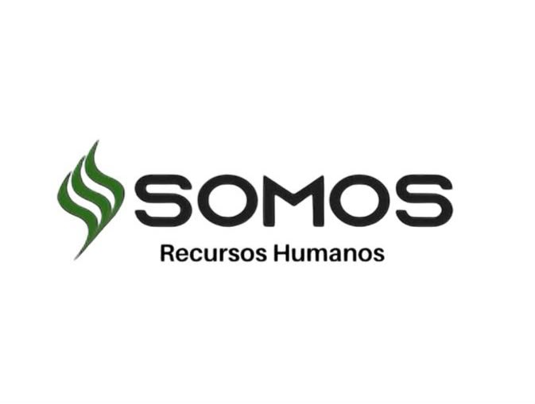
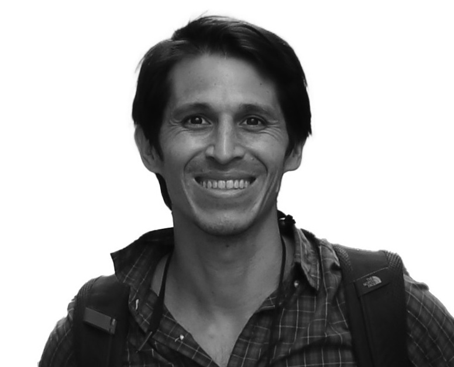

En La Constancia cuidamos un arboretum vivo con **más de 300 especies** de árboles
y arbustos, en Mar del Plata. A diferencia de la mayoría de los proyectos de
naturaleza, acá **cada árbol es trazable** —tiene su ficha, su ubicación y su código
QR—, y la información es abierta. Eso convierte el aporte de tu empresa en un
**impacto medible y verificable, sin greenwashing**.

Trabajamos con empresas de **varias formas**: sumarse a la Red de Empresas es una de
ellas, pero también podés contratar una experiencia puntual o patrocinar un
programa. Elegí la que mejor se adapte a tu organización.

## Formas de trabajar con nosotros

::: grid

::: {.g-col-6 .card .p-4 .shadow-sm}
### <i class="bi bi-people"></i> Experiencias y eventos corporativos
Jornadas de *team-building*, **bienestar y baños de bosque**, retiros, observación
de aves y eventos en un entorno único. No hace falta ser miembro de la Red.

[Ver eventos de empresa →](eventos.qmd){.btn .btn-outline-success .btn-sm role="button"}
:::

::: {.g-col-6 .card .p-4 .shadow-sm}
### 🌱 Alianzas de impacto (ESG)
Patrociná la conservación del arboretum y recibí un **reporte anual de impacto**
—biodiversidad y carbono estimado— trazable y con tu marca. Ideal para reportes de
sustentabilidad.

[Consultar →](contacto.qmd){.btn .btn-outline-success .btn-sm role="button"}
:::

::: {.g-col-6 .card .p-4 .shadow-sm}
### <i class="bi bi-mortarboard"></i> Educación patrocinada (RSE)
Financiá visitas de escuelas y material educativo. Una historia de responsabilidad
social concreta y con alcance local.

[Consultar →](contacto.qmd){.btn .btn-outline-success .btn-sm role="button"}
:::

::: {.g-col-6 .card .p-4 .shadow-sm}
### <i class="bi bi-map"></i> La plataforma
¿Tenés un espacio verde o colección? Llevalo a un **atlas digital** como este.

[Conocé el sistema →](el-sistema.qmd){.btn .btn-outline-success .btn-sm role="button"}
:::

::: {.g-col-6 .card .p-4 .shadow-sm}
### <i class="bi bi-tree"></i> Red de Empresas
Sumate a una **red de empresas con propósito**, con beneficios continuos, networking
e impacto compartido.

[Conocé la Red →](#red){.btn .btn-success .btn-sm role="button"}
:::

:::

## Por qué La Constancia

::: grid

::: {.g-col-4 .card .p-3 .shadow-sm .text-center}
**Transparencia total**<br>Datos abiertos, una ficha y un QR por árbol.
:::

::: {.g-col-4 .card .p-3 .shadow-sm .text-center}
**Método científico**<br>Índices de biodiversidad y estimación de carbono con metodología reconocida.
:::

::: {.g-col-4 .card .p-3 .shadow-sm .text-center}
**Plataforma funcionando**<br>Este mismo sitio es la prueba viva de lo que hacemos.
:::

:::

## Nuestro impacto

::: grid

::: {.g-col-3 .card .p-3 .text-center .shadow-sm .m-1}
<div style="font-size:2rem;font-weight:700;color:#1E4A38;">+300</div>
<div>Especies</div>
:::

::: {.g-col-3 .card .p-3 .text-center .shadow-sm .m-1}
<div style="font-size:2rem;font-weight:700;color:#1E4A38;"><i class="bi bi-tree"></i></div>
<div>Biodiversidad monitoreada</div>
:::

::: {.g-col-3 .card .p-3 .text-center .shadow-sm .m-1}
<div style="font-size:2rem;font-weight:700;color:#1E4A38;">CO₂</div>
<div>Carbono estimado por ejemplar</div>
:::

::: {.g-col-3 .card .p-3 .text-center .shadow-sm .m-1}
<div style="font-size:2rem;font-weight:700;color:#1E4A38;">QR</div>
<div>Trazabilidad total</div>
:::

:::

# Red de Empresas del Arboretum {#red}

La **Red de Empresas del Arboretum** invita a organizaciones a formar parte de un
proyecto que integra **naturaleza, bienestar, educación y comunidad**. Sumarse es
construir un legado que trasciende, con impacto **trazable y verificable**.

::: {.panel-tabset}

### <i class="bi bi-flower2"></i> ¿Por qué sumarte?

- Formar parte del primer jardín botánico de Mar del Plata, un espacio donde naturaleza, comunidad y empresas generan impacto real.
- Asociar tu organización a valores de sostenibilidad, innovación y futuro.
- Integrarte a una red empresarial con propósito.

### <i class="bi bi-bar-chart"></i> Beneficios

- Presencia en redes sociales y materiales institucionales.
- Networking empresarial.
- Encuentros sobre sostenibilidad y triple impacto.
- Actividades de bienestar en la naturaleza.
- Jornadas de voluntariado corporativo.

### <i class="bi bi-people"></i> Cómo participar

- Sponsoreo de proyectos del arboretum.
- Aportes en especie o colaboración institucional.

:::

### Proyectos que podés apoyar

::: grid

::: {.g-col-4 .card .p-3 .shadow-sm}
🪧 **Señalética educativa**
:::

::: {.g-col-4 .card .p-3 .shadow-sm}
<i class="bi bi-signpost-2"></i> **Senderos interpretativos**
:::

::: {.g-col-4 .card .p-3 .shadow-sm}
🪑 **Bancos y espacios de descanso**
:::

::: {.g-col-4 .card .p-3 .shadow-sm}
<i class="bi bi-tree"></i> **Identificación de especies**
:::

::: {.g-col-4 .card .p-3 .shadow-sm}
🚻 **Baños ecológicos e inclusivos**
:::

::: {.g-col-4 .card .p-3 .shadow-sm}
🌱 **Reforestación y nuevas colecciones**
:::

:::

### Empresas fundadoras de la Red

<div style="text-align:center; margin:1.2rem 0;">
  
</div>

*Las empresas fundadoras acompañan a la Red desde sus inicios. ¿Querés sumar la tuya?*

## Coordinación

::: grid

::: {.g-col-6 .card .p-4 .shadow-sm .text-center}
{.admin-photo}

### Magdalena Zurita
Coordinación institucional, programas educativos y conservación.

[🔗 LinkedIn](https://www.linkedin.com/in/magdalenazurita/){target="_blank"}
:::

::: {.g-col-6 .card .p-4 .shadow-sm .text-center}
{.admin-photo}

### Juan Ignacio Zurita
Desarrollo estratégico, vinculación con empresas y comunicación institucional.

[🔗 LinkedIn](https://www.linkedin.com/in/juan-ignacio-z-4b345425/){target="_blank"}
:::

:::

## Hacia dónde vamos

Estamos construyendo capacidades de datos de alto valor para partners de
investigación y desarrollo: **datos de resiliencia climática**, una **red de
fenología** con sensores, un **gemelo digital** del arboretum y **conjuntos de datos
listos para inteligencia artificial**. Si tu empresa mira al futuro de la naturaleza
y los datos, hablemos.

## Expresá tu interés

::: {.callout-tip}
Contanos qué busca tu organización y armamos una propuesta a medida.

[Quiero trabajar con el arboretum](contacto.qmd){.btn .btn-success .btn-lg role="button"}

<i class="bi bi-envelope"></i> **[laconstanciaargentina@gmail.com](mailto:laconstanciaargentina@gmail.com)**

<i class="bi bi-file-earmark-text"></i> [Descargar dossier corporativo (PDF)](recursos/dossier_empresas.pdf)
:::

## Contacto y ubicación

**Correo:** [laconstanciaargentina@gmail.com](mailto:laconstanciaargentina@gmail.com)
**Ubicación:** Arboretum de Estancia La Constancia, Camino 515, Mar del Plata, Argentina

<a href="https://maps.app.goo.gl/jQaTGHeaecL4icSg9" target="_blank" rel="noopener" class="btn btn-outline-success" role="button">
<i class="bi bi-geo-alt"></i> Abrir en Google Maps
</a>

## Conocé el proyecto

```{=html}
<div style="max-width:340px; margin:1.2rem auto;">
  <div style="position:relative; padding-bottom:177.78%; height:0; border-radius:12px; overflow:hidden; box-shadow:0 4px 15px rgba(0,0,0,.12);">
    <iframe src="https://www.youtube.com/embed/L8beVeOx_PE"
      title="Somos Equipo — La Constancia"
      style="position:absolute; top:0; left:0; width:100%; height:100%; border:0;"
      allow="accelerometer; autoplay; clipboard-write; encrypted-media; gyroscope; picture-in-picture; web-share"
      allowfullscreen></iframe>
  </div>
</div>
```
