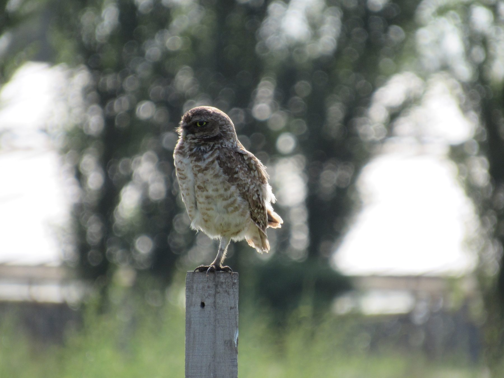
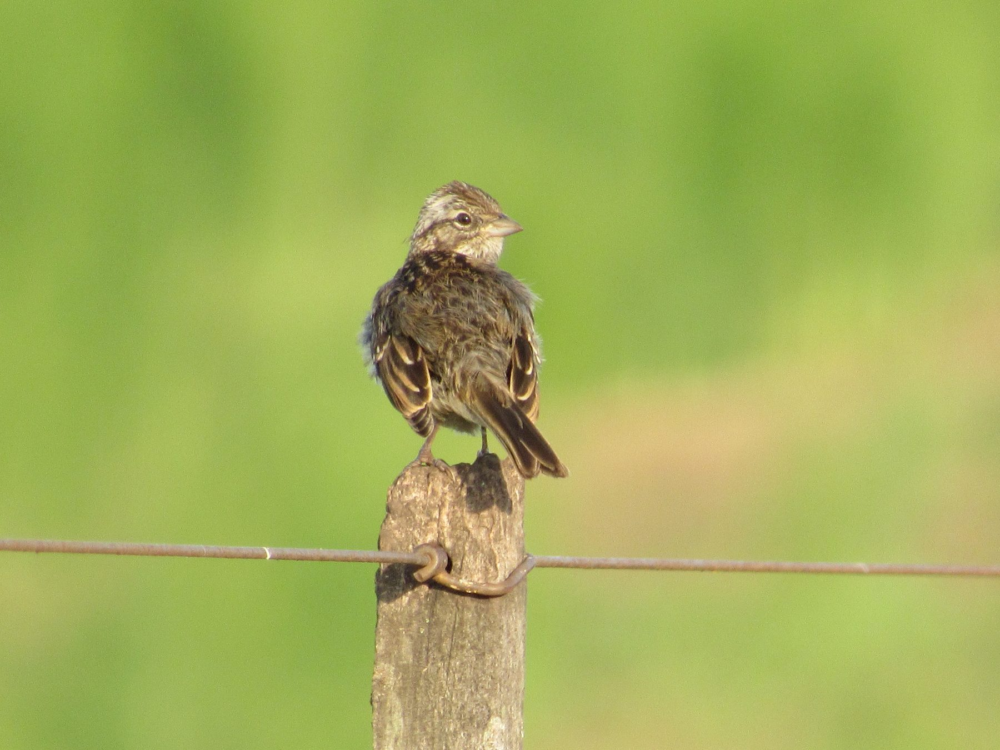
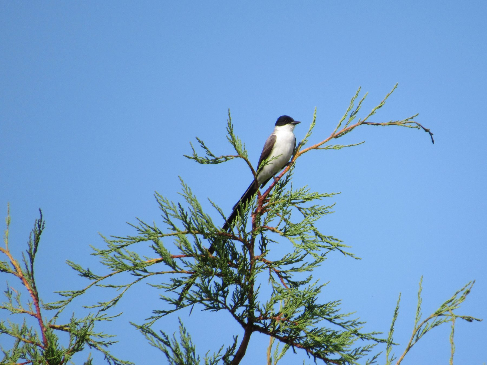
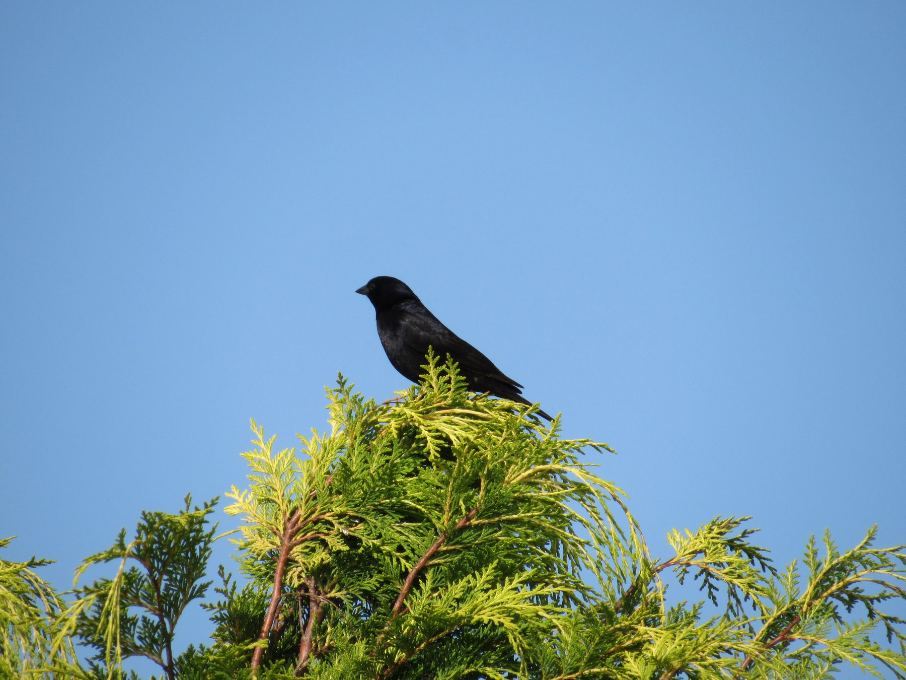

```{=html}
<style>#quarto-header,.navbar{display:none !important;}</style>
<div class="en-nav">
  <span class="brand">Arboretum</span>
  <a href="index.html">Home</a>
  <a href="collection.html" class="current">The Collection</a>
  <a href="map.html">Map</a>
  <a href="wellbeing.html">Wellbeing</a>
  <a href="visit.html">Visit</a>
  <a href="sponsor.html">Sponsor a tree</a>
  <a href="companies.html">Companies</a>
  <a href="contact.html">Contact</a>
  <span class="spacer"></span>
  <a href="experiences.html" class="cta">Book a visit</a>
  <a href="../aves.html" class="lang">Español ▸</a>
</div>
```

```{r}
source("scripts/cargar_datos.R")

# All birds with a recorded species (with or without a photo)
av <- aves %>%
  filter(tiene_valor(especie)) %>%
  mutate(
    res  = ifelse(tiene_valor(residencia), residencia, "No data"),
    res_norm = dplyr::case_when(
      grepl("Permanente", res) ~ "Resident",
      grepl("Migrat",     res) ~ "Migratory",
      grepl("Visitante",  res) ~ "Visitor",
      TRUE                     ~ res
    ),
    obs  = ifelse(tiene_valor(observacion), observacion, ""),
    obs_norm = tolower(iconv(obs, to = "ASCII//TRANSLIT")),
    est = vapply(obs_norm, function(o) {
      if (grepl("todo el ano", o, fixed = TRUE)) return("Spring Summer Autumn Winter")
      t <- character(0)
      if (grepl("primavera", o)) t <- c(t, "Spring")
      if (grepl("verano",    o)) t <- c(t, "Summer")
      if (grepl("otono",     o)) t <- c(t, "Autumn")
      if (grepl("invierno",  o)) t <- c(t, "Winter")
      paste(t, collapse = " ")
    }, character(1), USE.NAMES = FALSE),
    sci  = ifelse(tiene_valor(nombre_cientifico), nombre_cientifico, "")
  ) %>%
  arrange(especie)

esc <- function(x){x<-as.character(x);x<-gsub("&","&amp;",x,fixed=TRUE);x<-gsub("<","&lt;",x,fixed=TRUE);x<-gsub(">","&gt;",x,fixed=TRUE);gsub('"',"&quot;",x,fixed=TRUE)}
opciones <- function(v) paste0("<option value=\"\">All</option>", paste0("<option value=\"",esc(v),"\">",esc(v),"</option>",collapse=""))
```

`r nrow(av)` bird species have been recorded on the estate. Search by name or filter
by residence type. *(Common names are shown in Spanish, the local names.)*

## Featured birds

```{=html}
<div class="galeria-dest">
  <figure><figcaption>Burrowing owl (Lechucita vizcachera)</figcaption></figure>
  <figure><figcaption>Rufous-collared sparrow (Chingolo)</figcaption></figure>
  <figure><figcaption>Fork-tailed flycatcher (Tijereta)</figcaption></figure>
  <figure><figcaption>Shiny cowbird (Tordo renegrido)</figcaption></figure>
</div>
```

## All species

```{r results='asis'}
cat(sprintf('
<style>
  .ave-controles{display:flex;flex-wrap:wrap;gap:.6rem;align-items:end;margin:1rem 0;}
  .ave-controles label{font-size:.8rem;color:#555;display:block;}
  .ave-controles input,.ave-controles select{padding:.4rem .5rem;border:1px solid #ccc;border-radius:6px;}
  #ave-conteo{color:#666;font-size:.85rem;margin:.2rem 0 1rem;}
  .ave-grid{display:grid;grid-template-columns:repeat(auto-fill,minmax(190px,1fr));gap:1rem;}
  .ave-card{border:1px solid #eee;border-radius:10px;overflow:hidden;box-shadow:0 1px 4px rgba(0,0,0,.05);background:#fff;}
  .ave-foto{height:150px;background:#eef4f0;display:flex;align-items:center;justify-content:center;}
  .ave-foto img{width:100%%;height:150px;object-fit:cover;}
  .ave-foto .ph{font-size:2.4rem;color:#9cc3b1;}
  .ave-info{padding:.6rem .7rem;}
  .ave-info h4{margin:.1rem 0;font-size:1rem;}
  .ave-info .sci{font-style:italic;color:#666;font-size:.85rem;margin-bottom:.4rem;}
  .ave-badge{display:inline-block;font-size:.72rem;padding:.1rem .5rem;border:1px solid #1E4A38;color:#1E4A38;border-radius:999px;}
  .ave-info .season{font-size:.78rem;color:#555;margin-top:.35rem;}
</style>
<div class="ave-controles">
  <div><label>Search</label><input type="text" id="ave-q" placeholder="name or species..."></div>
  <div><label>Residence</label><select id="ave-res">%s</select></div>
  <div><label>Season</label><select id="ave-est">%s</select></div>
</div>
<div id="ave-conteo"></div>
<div class="ave-grid" id="ave-grid">',
opciones(sort(unique(av$res_norm))),
opciones(c("Spring","Summer","Autumn","Winter"))))

for (i in seq_len(nrow(av))) {
  a <- av[i, ]
  buscar <- tolower(iconv(paste(a$especie, a$sci), to = "ASCII//TRANSLIT"))
  foto <- if (tiene_valor(a$foto))
    sprintf('', esc(a$foto), esc(a$especie))
  else '<span class="ph">🕊️</span>'
  season_en <- gsub(" ", " · ", a$est)
  cat(sprintf(
'<div class="ave-card" data-res="%s" data-est="%s" data-buscar="%s"><div class="ave-foto">%s</div><div class="ave-info"><h4>%s</h4><div class="sci">%s</div><span class="ave-badge">%s</span>%s</div></div>\n',
    esc(a$res_norm), esc(a$est), esc(buscar), foto,
    esc(a$especie),
    ifelse(nzchar(a$sci), esc(a$sci), "&nbsp;"),
    esc(a$res_norm),
    ifelse(nzchar(a$est), paste0('<div class="season">', esc(season_en), '</div>'), "")
  ))
}

cat('</div>
<script>
(function(){
  var q=document.getElementById("ave-q"), fr=document.getElementById("ave-res"),
      fe=document.getElementById("ave-est"),
      cards=document.querySelectorAll("#ave-grid .ave-card"), conteo=document.getElementById("ave-conteo");
  function aplica(){
    var qs=(q.value||"").toLowerCase(), vr=fr.value, ve=fe.value, n=0;
    cards.forEach(function(c){
      var ok=c.dataset.buscar.indexOf(qs)>=0 && (!vr || c.dataset.res===vr)
             && (!ve || (c.dataset.est||"").split(" ").indexOf(ve)>=0);
      c.style.display=ok?"":"none"; if(ok)n++;
    });
    conteo.textContent=n+" of "+cards.length+" species";
  }
  [q,fr,fe].forEach(function(e){e.addEventListener("input",aplica);e.addEventListener("change",aplica);});
  aplica();
})();
</script>')
```

---

*Photographs were surveyed by the biology and ecology teams working at Estancia La
Constancia.*
