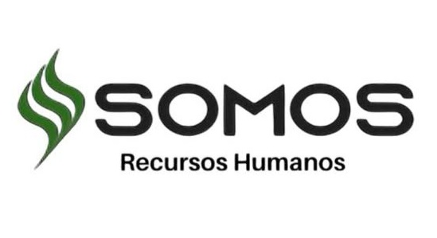
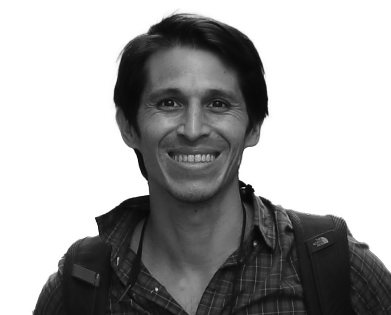

```{=html}
<style>#quarto-header,.navbar{display:none !important;}</style>
<div class="en-nav">
  <span class="brand">Arboretum</span>
  <a href="index.html">Home</a>
  <a href="collection.html">The Collection</a>
  <a href="map.html">Map</a>
  <a href="wellbeing.html">Wellbeing</a>
  <a href="visit.html">Visit</a>
  <a href="sponsor.html">Sponsor a tree</a>
  <a href="companies.html" class="current">Companies</a>
  <a href="contact.html">Contact</a>
  <span class="spacer"></span>
  <a href="experiences.html" class="cta">Book a visit</a>
  <a href="../empresas.html" class="lang">Español ▸</a>
</div>
```

At La Constancia we care for a living arboretum with **more than 300 species** of
trees and shrubs, in Mar del Plata. Unlike most nature projects, here **every tree is
traceable** —it has its own profile, location and QR code—, and the data is open.
That turns your company's contribution into **measurable, verifiable impact, with no
greenwashing**.

We work with companies in **several ways**: joining the Business Network is one of
them, but you can also book a specific experience or sponsor a program. Choose the one
that best fits your organization.

## Ways to work with us

::: grid

::: {.g-col-6 .card .p-4 .shadow-sm}
### <i class="bi bi-people"></i> Corporate experiences and events
*Team-building* days, **wellbeing and forest bathing**, retreats, birdwatching and
events in a unique setting. Network membership is not required.

[See corporate events →](../eventos.html){.btn .btn-outline-success .btn-sm role="button"}
:::

::: {.g-col-6 .card .p-4 .shadow-sm}
### 🌱 Impact partnerships (ESG)
Sponsor the arboretum's conservation and receive an **annual impact report**
—biodiversity and estimated carbon— traceable and branded with your company. Ideal for
sustainability reports.

[Enquire →](contact.html){.btn .btn-outline-success .btn-sm role="button"}
:::

::: {.g-col-6 .card .p-4 .shadow-sm}
### <i class="bi bi-mortarboard"></i> Sponsored education (CSR)
Fund school visits and educational materials. A concrete social-responsibility story
with local reach.

[Enquire →](contact.html){.btn .btn-outline-success .btn-sm role="button"}
:::

::: {.g-col-6 .card .p-4 .shadow-sm}
### <i class="bi bi-map"></i> The platform
Do you have a green space or collection? Bring it to a **digital atlas** like this one.

[Learn about the system →](../el-sistema.html){.btn .btn-outline-success .btn-sm role="button"}
:::

::: {.g-col-6 .card .p-4 .shadow-sm}
### <i class="bi bi-tree"></i> Business Network
Join a **network of purpose-driven companies**, with ongoing benefits, networking and
shared impact.

[Discover the Network →](#red){.btn .btn-success .btn-sm role="button"}
:::

:::

## Why La Constancia

::: grid

::: {.g-col-4 .card .p-3 .shadow-sm .text-center}
**Full transparency**<br>Open data, one profile and one QR code per tree.
:::

::: {.g-col-4 .card .p-3 .shadow-sm .text-center}
**Scientific method**<br>Biodiversity indices and carbon estimation with recognized methodology.
:::

::: {.g-col-4 .card .p-3 .shadow-sm .text-center}
**A platform that works**<br>This very website is living proof of what we do.
:::

:::

## Our impact

::: grid

::: {.g-col-3 .card .p-3 .text-center .shadow-sm .m-1}
<div style="font-size:2rem;font-weight:700;color:#1E4A38;">+300</div>
<div>Species</div>
:::

::: {.g-col-3 .card .p-3 .text-center .shadow-sm .m-1}
<div style="font-size:2rem;font-weight:700;color:#1E4A38;"><i class="bi bi-tree"></i></div>
<div>Monitored biodiversity</div>
:::

::: {.g-col-3 .card .p-3 .text-center .shadow-sm .m-1}
<div style="font-size:2rem;font-weight:700;color:#1E4A38;">CO₂</div>
<div>Estimated carbon per specimen</div>
:::

::: {.g-col-3 .card .p-3 .text-center .shadow-sm .m-1}
<div style="font-size:2rem;font-weight:700;color:#1E4A38;">QR</div>
<div>Full traceability</div>
:::

:::

# The Arboretum Business Network {#red}

The **Arboretum Business Network** invites organizations to be part of a project that
integrates **nature, wellbeing, education and community**. Joining means building a
legacy that lasts, with **traceable and verifiable** impact.

::: {.panel-tabset}

### <i class="bi bi-flower2"></i> Why join?

- Be part of the first botanical garden in Mar del Plata, a place where nature, community and companies generate real impact.
- Associate your organization with values of sustainability, innovation and the future.
- Join a business network with purpose.

### <i class="bi bi-bar-chart"></i> Benefits

- Presence on social media and institutional materials.
- Business networking.
- Gatherings on sustainability and triple impact.
- Wellbeing activities in nature.
- Corporate volunteering days.

### <i class="bi bi-people"></i> How to take part

- Sponsorship of arboretum projects.
- In-kind contributions or institutional collaboration.

:::

### Projects you can support

::: grid

::: {.g-col-4 .card .p-3 .shadow-sm}
🪧 **Educational signage**
:::

::: {.g-col-4 .card .p-3 .shadow-sm}
<i class="bi bi-signpost-2"></i> **Interpretive trails**
:::

::: {.g-col-4 .card .p-3 .shadow-sm}
🪑 **Benches and resting areas**
:::

::: {.g-col-4 .card .p-3 .shadow-sm}
<i class="bi bi-tree"></i> **Species identification**
:::

::: {.g-col-4 .card .p-3 .shadow-sm}
🚻 **Ecological, inclusive restrooms**
:::

::: {.g-col-4 .card .p-3 .shadow-sm}
🌱 **Reforestation and new collections**
:::

:::

### Founding companies of the Network

<div style="text-align:center; margin:1.2rem 0;">
  
</div>

*Founding companies have supported the Network from the start. Would you like to add
yours?*

## Coordination

::: grid

::: {.g-col-6 .card .p-4 .shadow-sm .text-center}
{.admin-photo}

### Magdalena Zurita
Institutional coordination, educational programs and conservation.

[🔗 LinkedIn](https://www.linkedin.com/in/magdalenazurita/){target="_blank"}
:::

::: {.g-col-6 .card .p-4 .shadow-sm .text-center}
{.admin-photo}

### Juan Ignacio Zurita
Strategic development, business relations and institutional communication.

[🔗 LinkedIn](https://www.linkedin.com/in/juan-ignacio-z-4b345425/){target="_blank"}
:::

:::

## Where we're heading

We are building high-value data capabilities for research and development partners:
**climate-resilience data**, a **phenology network** with sensors, a **digital twin**
of the arboretum, and **AI-ready datasets**. If your company is looking to the future
of nature and data, let's talk.

## Express your interest

::: {.callout-tip}
Tell us what your organization is looking for and we'll put together a tailored
proposal.

[I want to work with the arboretum](contact.html){.btn .btn-success .btn-lg role="button"}

<i class="bi bi-envelope"></i> **[laconstanciaargentina@gmail.com](mailto:laconstanciaargentina@gmail.com)**

<i class="bi bi-file-earmark-text"></i> [Download corporate dossier (PDF, in Spanish)](../recursos/dossier_empresas.pdf)
:::

## Contact and location

**Email:** [laconstanciaargentina@gmail.com](mailto:laconstanciaargentina@gmail.com)
**Location:** Arboretum at Estancia La Constancia, Camino 515, Mar del Plata, Argentina

<a href="https://maps.app.goo.gl/jQaTGHeaecL4icSg9" target="_blank" rel="noopener" class="btn btn-outline-success" role="button">
<i class="bi bi-geo-alt"></i> Open in Google Maps
</a>

## Discover the project

```{=html}
<div style="max-width:340px; margin:1.2rem auto;">
  <div style="position:relative; padding-bottom:177.78%; height:0; border-radius:12px; overflow:hidden; box-shadow:0 4px 15px rgba(0,0,0,.12);">
    <iframe src="https://www.youtube.com/embed/L8beVeOx_PE"
      title="Somos Equipo — La Constancia"
      style="position:absolute; top:0; left:0; width:100%; height:100%; border:0;"
      allow="accelerometer; autoplay; clipboard-write; encrypted-media; gyroscope; picture-in-picture; web-share"
      allowfullscreen></iframe>
  </div>
</div>
```
