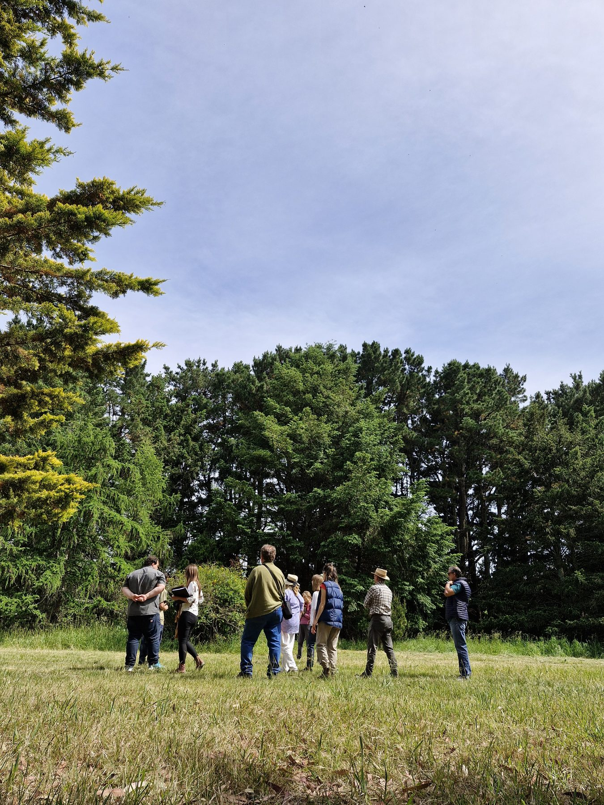
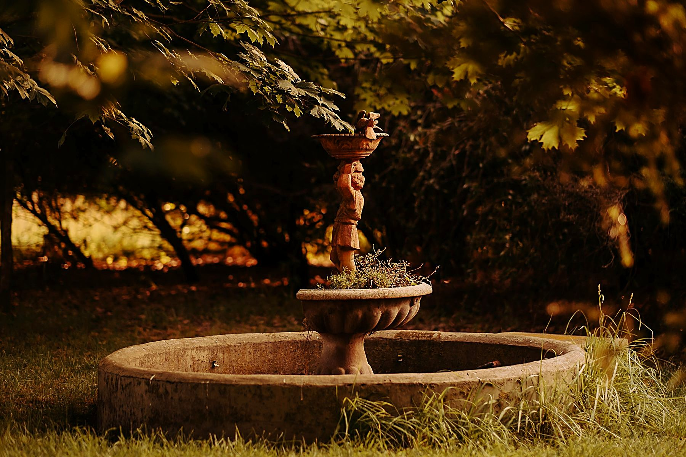
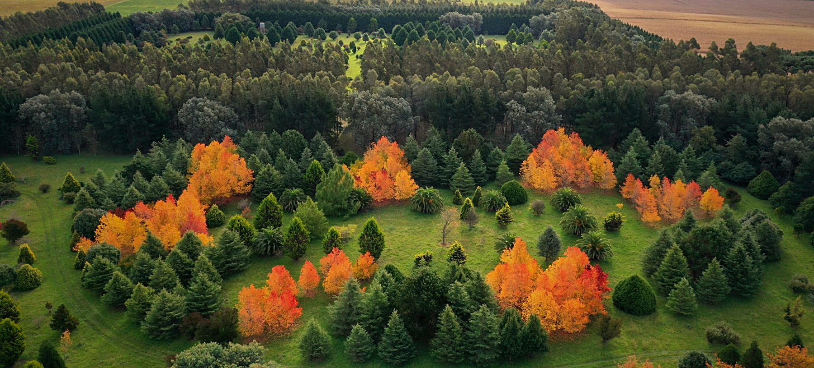

```{=html}
<style>#quarto-header,.navbar{display:none !important;}</style>
<div class="en-nav">
  <span class="brand">Arboretum</span>
  <a href="index.html">Home</a>
  <a href="collection.html">The Collection</a>
  <a href="map.html">Map</a>
  <a href="self-guided-tour.html">Self-guided tour</a>
  <a href="wellbeing.html">Wellbeing</a>
  <a href="visit.html">Visit</a>
  <a href="sponsor.html">Sponsor a tree</a>
  <a href="donate.html">Donate</a>
  <a href="companies.html">Companies</a>
  <a href="contact.html">Contact</a>
  <span class="spacer"></span>
  <a href="experiences.html" class="cta">Book a visit</a>
  <a href="../eventos.html" class="lang">Español ▸</a>
</div>
```

Minutes from **Mar del Plata**, the Arboretum at Estancia La Constancia offers a
unique natural setting —**33 hectares** and more than **300 species** of trees— for
corporate events to remember. An **exclusive, outdoor space with purpose**: each
gathering can, in addition, add real environmental impact.

<div style="text-align:center; margin:1.5rem 0 2rem;">
[<i class="bi bi-envelope"></i> Request a proposal](contact.html){.btn .btn-success .btn-lg role="button"}
&nbsp;
[<i class="bi bi-file-earmark-text"></i> Download corporate dossier (in Spanish)](../recursos/dossier_empresas.pdf){.btn .btn-outline-success .btn-lg role="button"}
</div>

## Ideal for

::: grid

::: {.g-col-12 .g-col-md-6 .card .p-4 .shadow-sm}
### <i class="bi bi-people"></i> Team integration and team-building
Outdoor days to strengthen teams, with activities in contact with nature.
:::

::: {.g-col-12 .g-col-md-6 .card .p-4 .shadow-sm}
### <i class="bi bi-compass"></i> Offsites, retreats and meetings
Strategic gatherings, planning and training away from the office, in an inspiring
setting.
:::

::: {.g-col-12 .g-col-md-6 .card .p-4 .shadow-sm}
### <i class="bi bi-flower1"></i> Corporate wellbeing
Forest bathing and guided wellbeing activities for teams looking to lower stress and
reconnect.
:::

::: {.g-col-12 .g-col-md-6 .card .p-4 .shadow-sm}
### <i class="bi bi-cup-straw"></i> Celebrations and toasts
Year-end parties, anniversaries, launches and company celebrations in a distinctive
natural setting.
:::

::: {.g-col-12 .g-col-md-6 .card .p-4 .shadow-sm}
### <i class="bi bi-mortarboard"></i> Training and workshops
Workshops and educational activities outdoors, among trees and gardens.
:::

::: {.g-col-12 .g-col-md-6 .card .p-4 .shadow-sm}
### <i class="bi bi-camera"></i> Photo and video productions
A natural location for institutional content, campaigns and brand shoots.
:::

:::

## Why choose La Constancia

::: grid

::: {.g-col-12 .g-col-md-4 .card .p-3 .shadow-sm .text-center}
**Unique, exclusive setting**<br>A private 33-hectare botanical garden, minutes from Mar del Plata.
:::

::: {.g-col-12 .g-col-md-4 .card .p-3 .shadow-sm .text-center}
**An event with purpose**<br>Add real environmental impact and tell it in your sustainability report.
:::

::: {.g-col-12 .g-col-md-4 .card .p-3 .shadow-sm .text-center}
**Tailored**<br>We build the proposal around your goal, group size and team style.
:::

:::

## The purpose-driven plus

What makes us different from an event hall: here your gathering can **leave a mark**.
Combine your event with an impact activity —a **planting with your team**, a **forest
bath**, or **sponsoring trees** in the company's name— and turn a day into a concrete
sustainability story, **traceable and verifiable**.

[See the proposal for companies →](companies.html){.btn .btn-outline-success role="button"}

## The space: outdoors

Events take place **outdoors**, in the park and gardens of the arboretum —spacious,
wooded and with total privacy—. It's the ideal option for those looking for a
different experience, in full nature rather than an enclosed hall.

::: {.callout-note}
As this is an outdoor activity, when arranging the event we set a **main date and an
alternative** in case the weather does not cooperate.
:::

## Services

- <i class="bi bi-clipboard-check"></i> **Event coordination** and tailored setup.
- <i class="bi bi-cup-hot"></i> **Gastronomy / catering** to be arranged.
- <i class="bi bi-flower2"></i> **Optional guided activities**: botanical tours, birdwatching, forest bathing, planting.
- <i class="bi bi-car-front"></i> **Parking** on the grounds.

## How we organize it

::: grid

::: {.g-col-12 .g-col-md-3 .card .p-3 .shadow-sm .text-center}
### 1. Tell us
You write to us with the idea, the tentative date and the number of people.
:::

::: {.g-col-12 .g-col-md-3 .card .p-3 .shadow-sm .text-center}
### 2. Tailored proposal
We design the event —space, activities and logistics— around your goal.
:::

::: {.g-col-12 .g-col-md-3 .card .p-3 .shadow-sm .text-center}
### 3. Confirmation
We coordinate the details and secure the date.
:::

::: {.g-col-12 .g-col-md-3 .card .p-3 .shadow-sm .text-center}
### 4. The big day
Your team enjoys a different kind of day, in full nature.
:::

:::

## Gallery

::: grid

::: {.g-col-12 .g-col-md-4}
{style="width:100%; height:240px; object-fit:cover; border-radius:12px;"}
:::

::: {.g-col-12 .g-col-md-4}
{style="width:100%; height:240px; object-fit:cover; border-radius:12px;"}
:::

::: {.g-col-12 .g-col-md-4}
{style="width:100%; height:240px; object-fit:cover; border-radius:12px;"}
:::

:::

## Follow us on Instagram

See the day-to-day of the arboretum and the estate on Instagram:

<a href="https://instagram.com/laconstanciadebiocca" target="_blank" rel="noopener" class="btn btn-outline-success" role="button"><i class="bi bi-instagram"></i> @laconstanciadebiocca</a>

## Request a proposal

Tell us what you have in mind and we'll put together a proposal to fit you.

::: {.callout-tip}
**Email:** [laconstanciaargentina@gmail.com](mailto:laconstanciaargentina@gmail.com)
· **WhatsApp:** [+54 9 11 5736 0940](https://wa.me/5491157360940)

[Request a proposal](contact.html){.btn .btn-success .btn-lg role="button"}
:::

## How to get here

**Arboretum at Estancia La Constancia**<br>
Camino 515, Mar del Plata · Buenos Aires · Argentina

<a href="https://maps.app.goo.gl/jQaTGHeaecL4icSg9" target="_blank" rel="noopener" class="btn btn-outline-success" role="button">
<i class="bi bi-geo-alt"></i> Open in Google Maps
</a>
