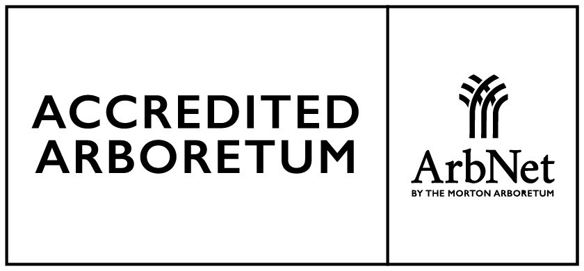

```{=html}
<style>#quarto-header,.navbar{display:none !important;}</style>
<div class="en-nav">
  <span class="brand">Arboretum</span>
  <a href="index.html" class="current">Home</a>
  <a href="collection.html">The Collection</a>
  <a href="map.html">Map</a>
  <a href="self-guided-tour.html">Self-guided tour</a>
  <a href="wellbeing.html">Wellbeing</a>
  <a href="visit.html">Visit</a>
  <a href="sponsor.html">Sponsor a tree</a>
  <a href="donate.html">Donate</a>
  <a href="companies.html">Companies</a>
  <a href="contact.html">Contact</a>
  <span class="spacer"></span>
  <a href="experiences.html" class="cta">Book a visit</a>
  <a href="../index.html" class="lang">Español ▸</a>
</div>

<style>
.home-hero{
  position:relative; width:100%; min-height:72vh; margin:0 0 2rem 0;
  background-image:linear-gradient(rgba(30,74,56,.32),rgba(30,74,56,.52)), url('../fotos/eventos/aerea_1.jpg');
  background-size:cover; background-position:center; border-radius:14px;
  display:flex; align-items:center; justify-content:center;
}
.home-hero-inner{ text-align:center; color:#fff; padding:3rem 1.5rem; max-width:760px; }
.home-hero-mark{ font-size:1rem; letter-spacing:.18em; text-transform:uppercase; font-weight:600; opacity:.95; margin-bottom:1.1rem; text-shadow:0 2px 12px rgba(0,0,0,.7); }
.home-hero-title{ color:#fff; font-size:clamp(2.6rem,6vw,4.4rem); font-weight:800; margin:.1rem 0; line-height:1.05; text-shadow:0 2px 20px rgba(0,0,0,.75); }
.home-hero-lema{ font-size:clamp(1.1rem,2.4vw,1.6rem); margin:.5rem auto 1rem; max-width:620px; text-shadow:0 2px 14px rgba(0,0,0,.85); }
.home-hero-loc{ font-size:.95rem; opacity:.95; margin-bottom:1.6rem; text-shadow:0 1px 10px rgba(0,0,0,.85); }
.home-hero-btns{ display:flex; gap:.8rem; flex-wrap:wrap; justify-content:center; }
.home-hero-ghost{ background:rgba(255,255,255,.14); color:#fff !important; border:2px solid #fff; }
.home-hero-ghost:hover{ background:rgba(255,255,255,.28); color:#fff !important; }
@media(max-width:768px){ .home-hero{ min-height:58vh; } }
</style>
<section class="home-hero">
  <div class="home-hero-inner">
    <div class="home-hero-mark">Estancia La Constancia</div>
    <h1 class="home-hero-title">Arboretum</h1>
    <p class="home-hero-lema">A place where nature educates, inspires and heals</p>
    <p class="home-hero-loc"><i class="bi bi-geo-alt"></i> Mar del Plata · Buenos Aires · Argentina</p>
    <div class="home-hero-btns">
      <a href="experiences.html" class="btn btn-success btn-lg" role="button">See experiences</a>
      <a href="sponsor.html" class="btn btn-lg home-hero-ghost" role="button"><i class="bi bi-tree"></i> Sponsor a tree</a>
    </div>
  </div>
</section>
```

::: {.lead-intro}
Welcome to the Arboretum at Estancia La Constancia, in **Mar del Plata, Argentina**: a living, 33-hectare botanical garden to **explore, learn and reconnect**. Discover its trees and birds, visit with your school, experience wellbeing among the trees, or bring your organization into conservation.
:::

::: {.callout-tip title="What is an arboretum?"}
An arboretum is a **living, documented** collection of trees and woody plants, grown for scientific, educational and conservation purposes: in essence, a **"living museum" of trees**. [Learn more »](https://en.wikipedia.org/wiki/Arboretum){target="_blank" rel="noopener"}
:::

```{=html}
<div class="stats-band">
  <div class="stat"><div class="num">33</div><div class="lbl">hectares</div></div>
  <div class="stat"><div class="num">+300</div><div class="lbl">plant species</div></div>
  <div class="stat"><div class="num">46</div><div class="lbl">bird species</div></div>
  <div class="stat"><div class="num">91</div><div class="lbl">mapped specimens</div></div>
  <a class="stat cred" href="https://arbnet.org/morton-register/la-constancia-de-biocca/" target="_blank" rel="noopener"><div class="num">Level I</div><div class="lbl">ArbNet Accreditation</div></a>
  <a class="stat cred" href="https://gardensearch.bgci.org/garden/7214" target="_blank" rel="noopener"><div class="num">BGCI</div><div class="lbl">Global network of botanic gardens</div></a>
</div>
```

## Discover the Arboretum

::: grid

::: {.g-col-12 .g-col-md-7 style="align-self:center;"}
In **one minute**, feel the spirit of the arboretum: 33 hectares of living nature in
Mar del Plata, a place to **explore, learn and reconnect**. Watch the spot and
discover everything you can experience here.

```{=html}
<div style="display:flex; flex-wrap:wrap; gap:1rem 1.6rem; margin:1.3rem 0 1.5rem; font-size:1rem;">
  <span><i class="bi bi-tree"></i> <b>+300 species</b> documented</span>
  <span><i class="bi bi-map"></i> <b>Interactive map</b> of the arboretum</span>
  <span><i class="bi bi-flower1"></i> <b>Wellbeing</b> experiences</span>
</div>
```

[See experiences](experiences.html){.btn .btn-success role="button"} &nbsp; [<i class="bi bi-tree"></i> Sponsor a tree](sponsor.html){.btn .btn-outline-success role="button"}
:::

::: {.g-col-12 .g-col-md-5}
```{=html}
<div style="max-width:300px; margin:0 auto;">
  <div style="position:relative; padding-bottom:177.78%; height:0; border-radius:12px; overflow:hidden; box-shadow:0 4px 15px rgba(0,0,0,.15);">
    <iframe src="https://www.youtube.com/embed/IRtRx_GnYI8" title="Institutional spot — Arboretum at Estancia La Constancia" style="position:absolute; top:0; left:0; width:100%; height:100%; border:0;" allow="accelerometer; autoplay; clipboard-write; encrypted-media; gyroscope; picture-in-picture; web-share" allowfullscreen loading="lazy"></iframe>
  </div>
</div>
```
:::

:::

::: {.band-warm}
## Experience the arboretum

::: grid

::: {.g-col-12 .g-col-md-4 .card .p-3 .shadow-sm .text-center}
### <i class="bi bi-mortarboard"></i> Educational visits
Tours and activities for schools and groups, designed by educational level.

[See visits →](educational-visits.html){.btn .btn-outline-success .btn-sm .mt-auto role="button"}
:::

::: {.g-col-12 .g-col-md-4 .card .p-3 .shadow-sm .text-center}
### <i class="bi bi-flower1"></i> Wellbeing
Forest bathing and guided wellbeing experiences among the trees.

[Discover wellbeing →](wellbeing.html){.btn .btn-outline-success .btn-sm .mt-auto role="button"}
:::

::: {.g-col-12 .g-col-md-4 .card .p-3 .shadow-sm .text-center}
### <i class="bi bi-tree"></i> Sponsor a tree
Join conservation by sponsoring a specimen and following its story.

[Sponsor →](sponsor.html){.btn .btn-outline-success .btn-sm .mt-auto role="button"}
:::

::: {.g-col-12 .g-col-md-4 .card .p-3 .shadow-sm .text-center}
### <i class="bi bi-people"></i> Purpose-driven companies
Bring your organization into conservation, with **traceable and verifiable** impact.

[See proposal →](companies.html){.btn .btn-outline-success .btn-sm .mt-auto role="button"}
:::

::: {.g-col-12 .g-col-md-4 .card .p-3 .shadow-sm .text-center}
### <i class="bi bi-hand-thumbs-up"></i> Volunteering
Lend a hand to a living botanical garden. We are building the team.

[Become a volunteer →](volunteer.html){.btn .btn-outline-success .btn-sm .mt-auto role="button"}
:::

::: {.g-col-12 .g-col-md-4 .card .p-3 .shadow-sm .text-center}
### <i class="bi bi-calendar-check"></i> Book your visit
General visits and experiences to enjoy the arboretum all year round.

[See experiences →](experiences.html){.btn .btn-outline-success .btn-sm .mt-auto role="button"}
:::

:::

:::

## Explore

The arboretum, documented specimen by specimen: browse the map, the trees and the
birds of a system that is truly **alive**.

::: grid

::: {.g-col-4 .card .p-3 .shadow-sm .text-center style="border-top: 3px solid #1E4A38;"}
### <i class="bi bi-geo-alt"></i> Interactive Map
Walk the trails, sectors and points of interest, and search for any species by name.

[Open the map →](map.html){.btn .btn-success .btn-sm .mt-auto role="button"}
:::

::: {.g-col-4 .card .p-3 .shadow-sm .text-center}
### <i class="bi bi-tree"></i> Featured Flora
Meet the most representative specimens of the arboretum's flora, of great botanical
and historical interest.

[Explore species →](species.html){.btn .btn-outline-success .btn-sm .mt-auto role="button"}
:::

::: {.g-col-4 .card .p-3 .shadow-sm .text-center}
### <i class="bi bi-binoculars"></i> Birds
Photo gallery and seasonal record of the birds observed on the estate.

[Explore birds →](birds.html){.btn .btn-outline-success .btn-sm .mt-auto role="button"}
:::

:::

## About the Arboretum

The Arboretum brings together the biological surveys carried out at Estancia La
Constancia to promote the conservation, research and environmental education of the
local biodiversity. The photographs and surveys on this site were produced by the
teams of biologists and ecologists who conduct monitoring work on the estate.

::: {.cta-band}
## Join our arboretum logbook

Bloom updates, seasonal birds, visits, workshops and events. One email every so
often, no spam. *(Newsletter in Spanish.)*

```{=html}
<div style="display:flex; justify-content:center; margin:1rem 0 .5rem;">
<iframe width="540" height="520" src="https://ef69cda6.sibforms.com/v2/serve/MUIFAA4AeDcdli4EG1UJeRVFdsarWWmyMou5_uMjqpsj63tdwCB10iczbUgX4KJtUVtlnyuCKXYIM81DZn7JiUy8ntQC5F2a3ZoVlfeIlwzBio1VenKN55qRFzTsfPHWMP_4RQh1feRFZ7T1esm1tsrsjD7GjfcRaIbWEl20bP_ja9QMFJx1ta8nhH-KmHbkMUjV6-B90SjW8L1N3g==" frameborder="0" scrolling="auto" allowfullscreen style="display:block; max-width:100%; min-height:520px;"></iframe>
</div>
```
:::

<div style="text-align:center; margin-top:3rem;">
  
</div>
