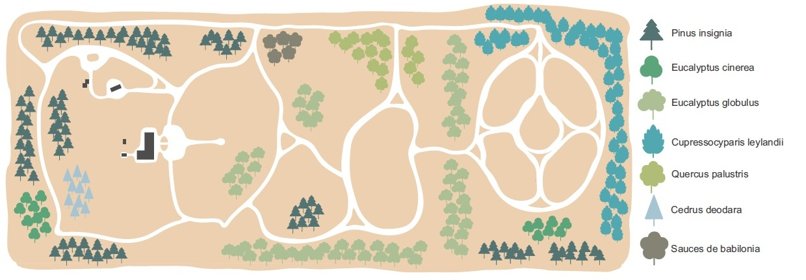
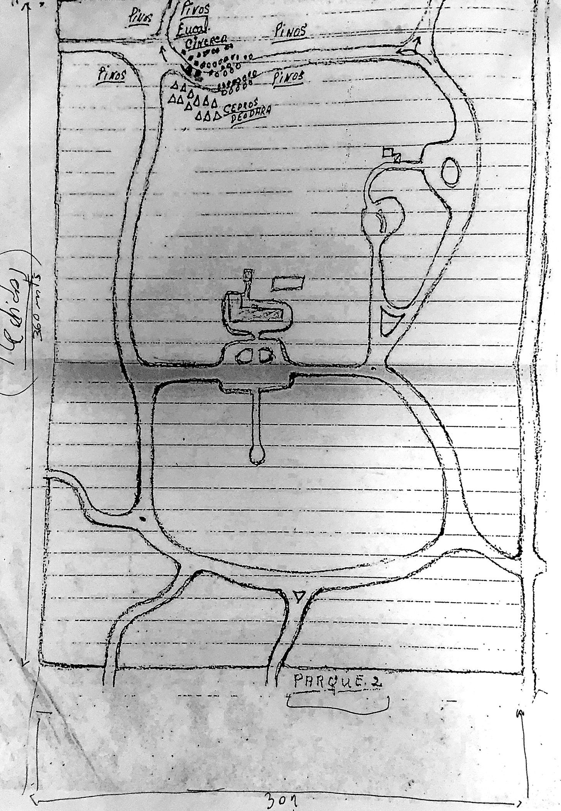
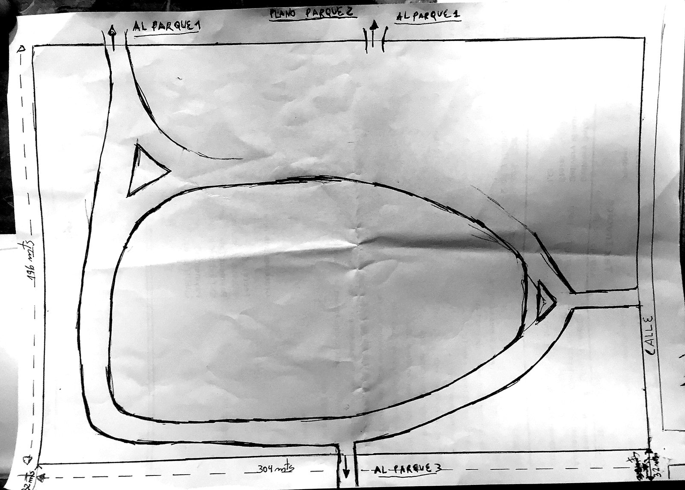
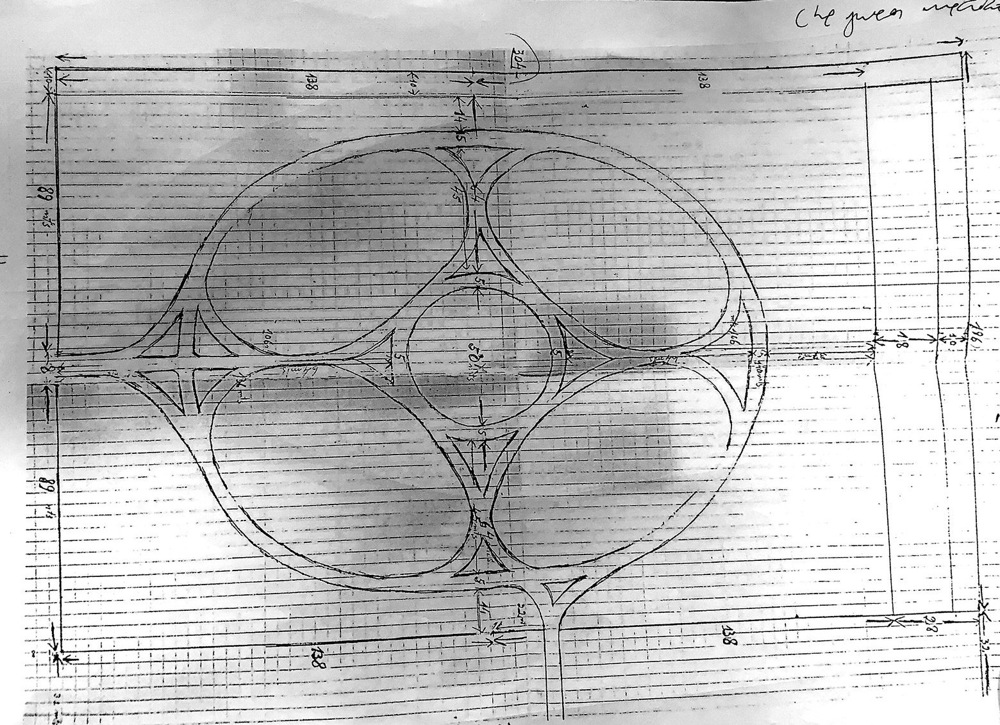

```{=html}
<style>#quarto-header,.navbar{display:none !important;}</style>
<div class="en-nav">
  <span class="brand">Arboretum</span>
  <a href="index.html">Home</a>
  <a href="collection.html" class="current">The Collection</a>
  <a href="map.html">Map</a>
  <a href="wellbeing.html">Wellbeing</a>
  <a href="visit.html">Visit</a>
  <a href="sponsor.html">Sponsor a tree</a>
  <a href="companies.html">Companies</a>
  <a href="contact.html">Contact</a>
  <span class="spacer"></span>
  <a href="experiences.html" class="cta">Book a visit</a>
  <a href="../plano.html" class="lang">Español ▸</a>
</div>
```

Explore the arboretum with this illustrated plan, which shows the layout of the main
collections and the trails of the estate. The species key is on the right of the plan.

<div style="text-align:center; margin:1.5rem 0;">
  
</div>

Would you rather explore specimen by specimen, with photos and profiles? Visit the
[interactive map »](map.html).

## The founder's original plans

Before this digital atlas existed, the arboretum was born from the pencil and ink of
its founder, who drew by hand the first plans of each sector of the park: where each
group of trees would go, how the trails would be laid out, and to what dimensions.
These are those original sketches, preserved as part of the history of the place.

::: {.callout-tip}
Click each plan to see it enlarged and read the founder's annotations.
:::

```{=html}
<style>
  .planos-galeria{display:flex;flex-wrap:wrap;gap:1.6rem;justify-content:center;align-items:flex-start;margin:1.6rem 0;}
  .plano-card{background:#f7f5ef;border:1px solid #e0dccf;border-radius:8px;padding:.6rem;box-shadow:0 4px 16px rgba(0,0,0,.12);max-width:330px;}
  .plano-card img{width:100%;height:auto;border-radius:4px;cursor:zoom-in;display:block;}
  .plano-card figcaption{font-size:.85rem;color:#555;margin-top:.55rem;line-height:1.4;}
  .plano-card figcaption strong{color:#1E4A38;}
  #lb-overlay{display:none;position:fixed;inset:0;background:rgba(0,0,0,.86);z-index:9999;align-items:center;justify-content:center;cursor:zoom-out;padding:2vh;}
  #lb-overlay img{max-width:95vw;max-height:90vh;box-shadow:0 8px 40px rgba(0,0,0,.5);border-radius:4px;}
  #lb-cap{position:absolute;bottom:1.1rem;left:0;right:0;text-align:center;color:#eee;font-size:.9rem;padding:0 1rem;}
  #lb-close{position:absolute;top:.8rem;right:1.3rem;color:#fff;font-size:2.2rem;line-height:1;cursor:pointer;}
</style>

<div class="planos-galeria">
  <figure class="plano-card">
    
    <figcaption><strong>Park 1</strong> — The planting scheme: the species groups annotated by hand (pines, deodar cedars, cypresses and more).</figcaption>
  </figure>
  <figure class="plano-card">
    
    <figcaption><strong>Park 2</strong> — The trail layout and its connection with parks 1 and 3 (304 × 190 m).</figcaption>
  </figure>
  <figure class="plano-card">
    
    <figcaption><strong>Park 3</strong> — The geometric design of the sector, with detailed measurements on graph paper.</figcaption>
  </figure>
</div>

<div id="lb-overlay">
  <span id="lb-close">&times;</span>
  
  <div id="lb-cap"></div>
</div>

<script>
(function(){
  var ov=document.getElementById("lb-overlay"),
      im=document.getElementById("lb-img"),
      cap=document.getElementById("lb-cap");
  document.querySelectorAll(".plano-zoom").forEach(function(t){
    t.addEventListener("click",function(){
      im.src=t.getAttribute("src"); im.alt=t.getAttribute("alt");
      cap.textContent=t.getAttribute("data-cap")||"";
      ov.style.display="flex";
    });
  });
  function cerrar(){ ov.style.display="none"; im.src=""; }
  ov.addEventListener("click",cerrar);
  document.addEventListener("keydown",function(e){ if(e.key==="Escape") cerrar(); });
})();
</script>
```

**From the plan to today's garden.** Those hand-drawn strokes became the arboretum
you can walk through today: see how it turned out in the illustrated plan above, and
explore each specimen, with photos and profiles, on the [interactive map »](map.html).
