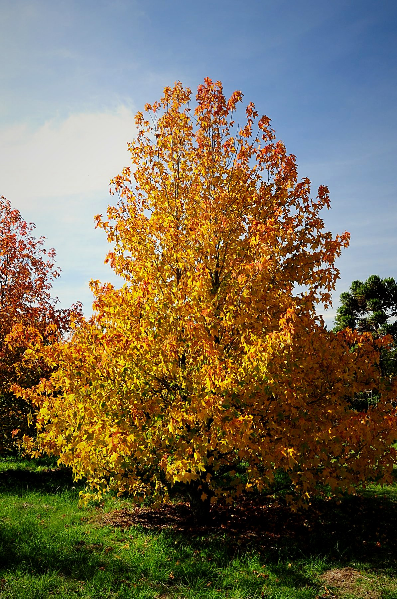
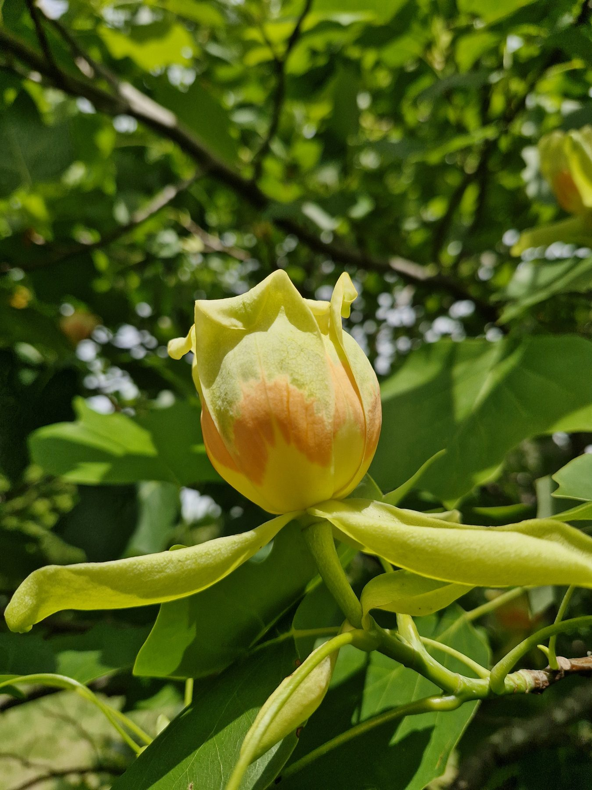
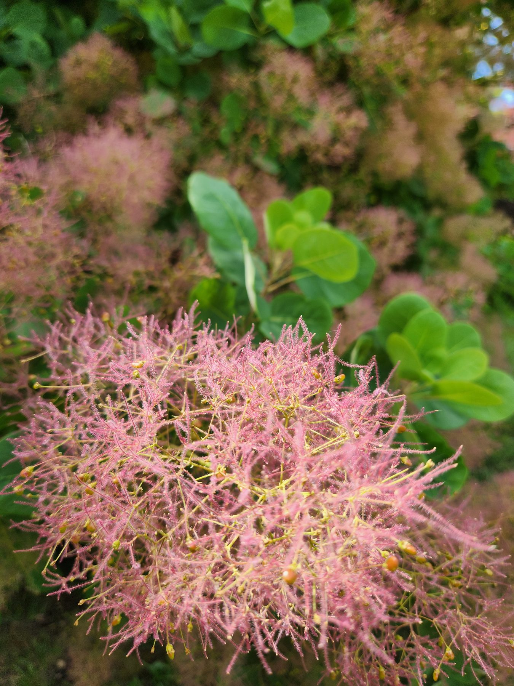

```{=html}
<style>#quarto-header,.navbar{display:none !important;}</style>
<div class="en-nav">
  <span class="brand">Arboretum</span>
  <a href="index.html">Home</a>
  <a href="collection.html" class="current">The Collection</a>
  <a href="map.html">Map</a>
  <a href="wellbeing.html">Wellbeing</a>
  <a href="visit.html">Visit</a>
  <a href="sponsor.html">Sponsor a tree</a>
  <a href="companies.html">Companies</a>
  <a href="contact.html">Contact</a>
  <span class="spacer"></span>
  <a href="experiences.html" class="cta">Book a visit</a>
  <a href="../especies.html" class="lang">Español ▸</a>
</div>
```

```{r}
#| echo: false
#| message: false
#| warning: false

# Shared loader: gives `arboles` with the same `slug` used by the fichas.
source("scripts/cargar_datos.R")

arboles_destacados <- arboles %>%
  filter(destacado == 1)
```

Specimens selected for their botanical, historical or scenic value.

```{=html}
<div class="galeria-dest">
  <figure><figcaption>Sweetgum in autumn</figcaption></figure>
  <figure><figcaption>Tulip tree in bloom</figcaption></figure>
  <figure><figcaption>Smoke tree (Cotinus)</figcaption></figure>
</div>
```

```{r results='asis', echo=FALSE}

cat("::: {.grid}\n\n")

for (i in seq_len(nrow(arboles_destacados))) {

  a <- arboles_destacados[i, ]

  cat("::: {.g-col-4}\n\n")
  cat("::: {.card .text-center}\n\n")

  # Name -> link to the generated profile (same slug as generar_fichas.R)
  cat(paste0(
    "####  [", a$nombre_comun, "](fichas/", a$slug, ".qmd)\n\n"
  ))

  # Small photo
  if (tiene_valor(a$foto)) {
    cat(paste0(
      "<div style='text-align:center;'>",
      "{width=150 style='height:150px; object-fit:cover; border-radius:8px;'}",
      "</div>\n\n"
    ))
  }

  # Minimal info
  if (tiene_valor(a$familia)) {
    cat(paste0("**Family:** ", a$familia, "\n\n"))
  }

  cat(":::\n\n")
  cat(":::\n\n")
}

cat(":::\n")
```

::: {.callout-note}
Common names are shown in Spanish; scientific names are universal. Each name opens
its profile (currently in Spanish).
:::
