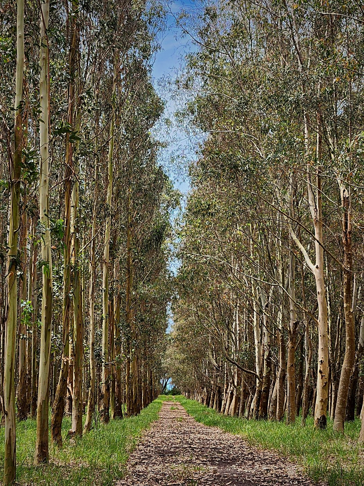
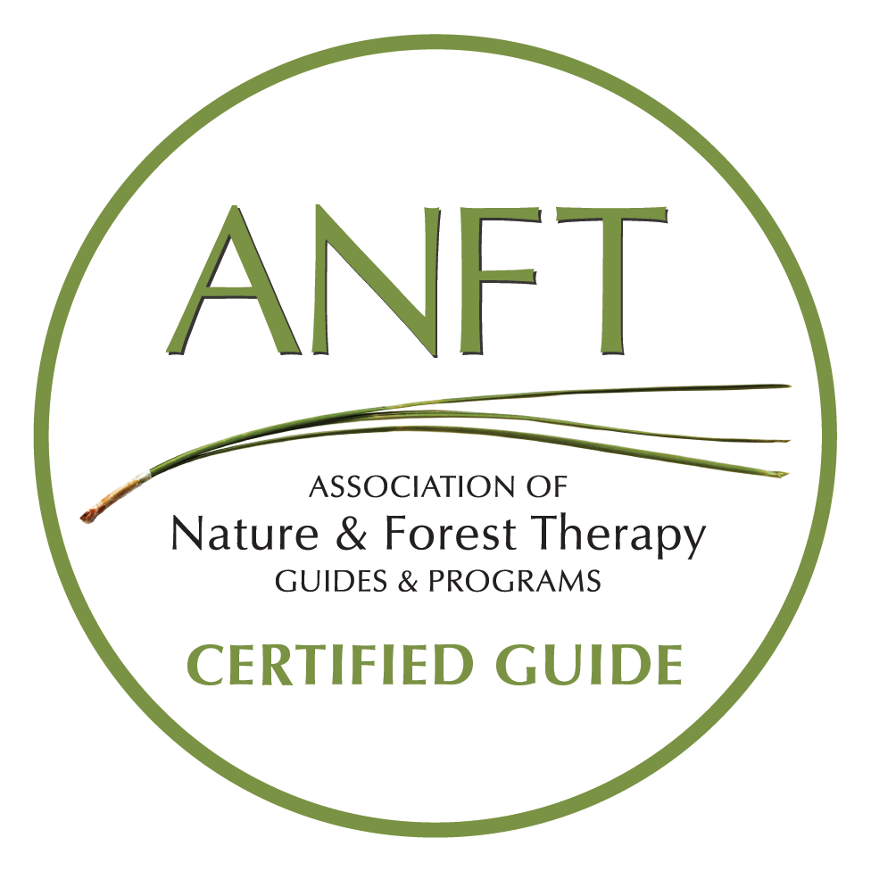
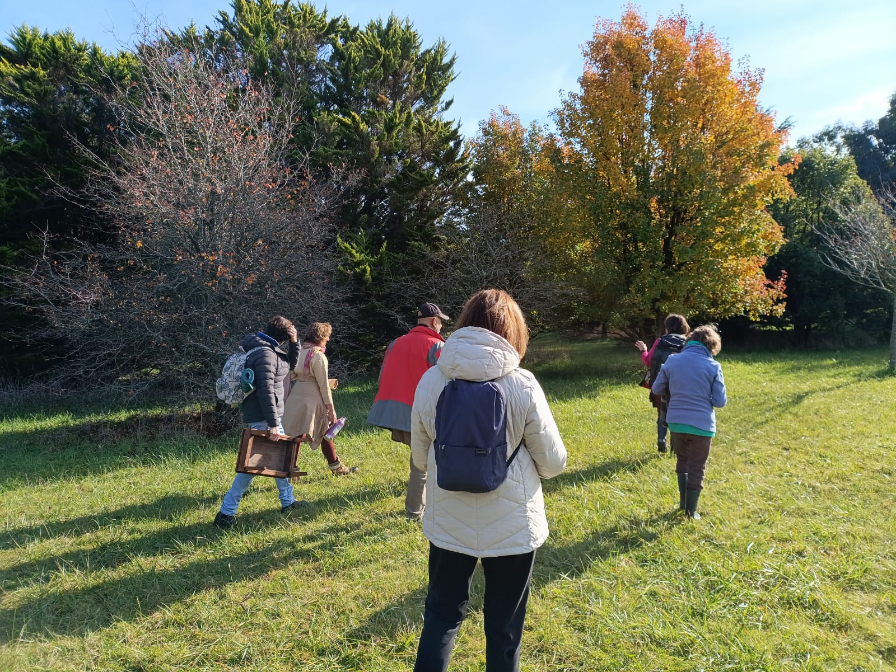
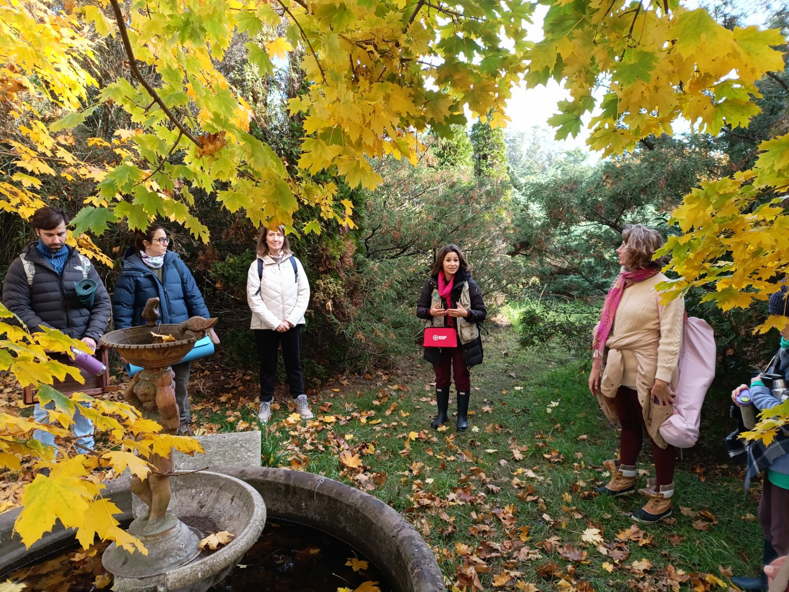

```{=html}
<style>#quarto-header,.navbar{display:none !important;}</style>
<div class="en-nav">
  <span class="brand">Arboretum</span>
  <a href="index.html">Home</a>
  <a href="collection.html">The Collection</a>
  <a href="../mapa.html">Map</a>
  <a href="wellbeing.html" class="current">Wellbeing</a>
  <a href="visit.html">Visit</a>
  <a href="sponsor.html">Sponsor a tree</a>
  <a href="companies.html">Companies</a>
  <a href="contact.html">Contact</a>
  <span class="spacer"></span>
  <a href="experiences.html" class="cta">Book a visit</a>
  <a href="../bienestar.html" class="lang">Español ▸</a>
</div>
```

Beyond conserving and educating, the arboretum is a place to **feel better**. Among
its trails and collections we offer guided wellbeing experiences, designed to slow
down, reconnect with the surroundings and care for emotional health.

<div style="text-align:center; margin:1.2rem 0 1.6rem;">
  
</div>

## Forest bathing (*shinrin-yoku*)

*Shinrin-yoku* —literally "forest bathing"— is a practice born in Japan that
consists of spending time, consciously and unhurriedly, among the trees: observing,
breathing, listening and perceiving the surroundings with all the senses. It is not
a sports walk or an excursion; it is an invitation to **stop and perceive**.

It emerged in **Japan in the 1980s** as a response to urban stress and as a public
health strategy, and today it is a practice found around the world, with dozens of
certified trails. It **requires no prior experience** and is accessible to everyone.

### What the science says

Research on forest bathing, developed especially in Japan and Korea, associates the
practice with health benefits, among them:

- Regulation of the **nervous system** and stabilization of **blood pressure**.
- Reduced **stress** levels (lower cortisol).
- Improvements in **mood** and a sense of calm.
- Stimulation of the **immune system** (greater activity of "natural killer" cells).
- Better **attention, memory and creativity**.

In countries such as **Canada**, health professionals recommend it as a therapeutic
complement.

::: {.callout-note}
Wellbeing experiences are a **complement** to health care and rest; they do not
replace medical or psychological treatment.
:::

## Led by a certified guide

Our forest bathing experiences are led by **Magdalena Zurita**, a **certified guide**
in forest bathing through the **Association of Nature and Forest Therapy (ANFT)** of
the United States. It is still an uncommon offering in the country, and therefore an
added value of the arboretum.

<div style="text-align:center; margin:1.2rem 0;">
  
</div>

## What an experience is like

Each session lasts **around three hours**, with stops and invitations along the way,
in a **private or group format**. It combines slow walking, attention and breathing
exercises, pauses for observation and a shared closing. It can be adapted for
**individuals, families or work teams** (corporate wellbeing days).

```{=html}
<div class="galeria-dest" style="grid-template-columns:repeat(auto-fit,minmax(280px,1fr));">
  <figure>
    
    <figcaption>Slow, mindful walking through the collections, in autumn.</figcaption>
  </figure>
  <figure>
    
    <figcaption>A pause for observation beside the fountain, with the guide.</figcaption>
  </figure>
</div>
```

### In the media

- **Forbes** — [«Forest bathing»: the Japanese method backed by science to reduce stress](https://www.forbesargentina.com/liderazgo/bano-bosque-metodo-japones-respaldado-ciencia-reducir-estres-potenciar-productividad-n81343){target="_blank" rel="noopener"} *(in Spanish)*

> "The forest is the therapist. The guide opens the doors."

::: {.callout-tip}
Would you like to arrange a wellbeing experience, individually or for your team?
Write to us from the [**Contact**](contact.html) page.
:::
