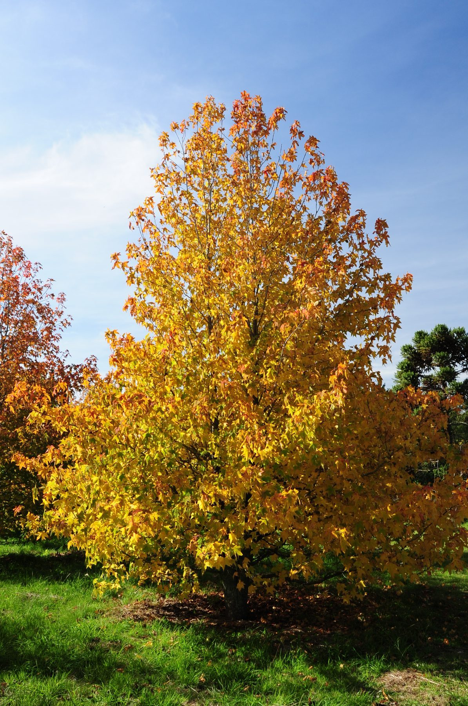
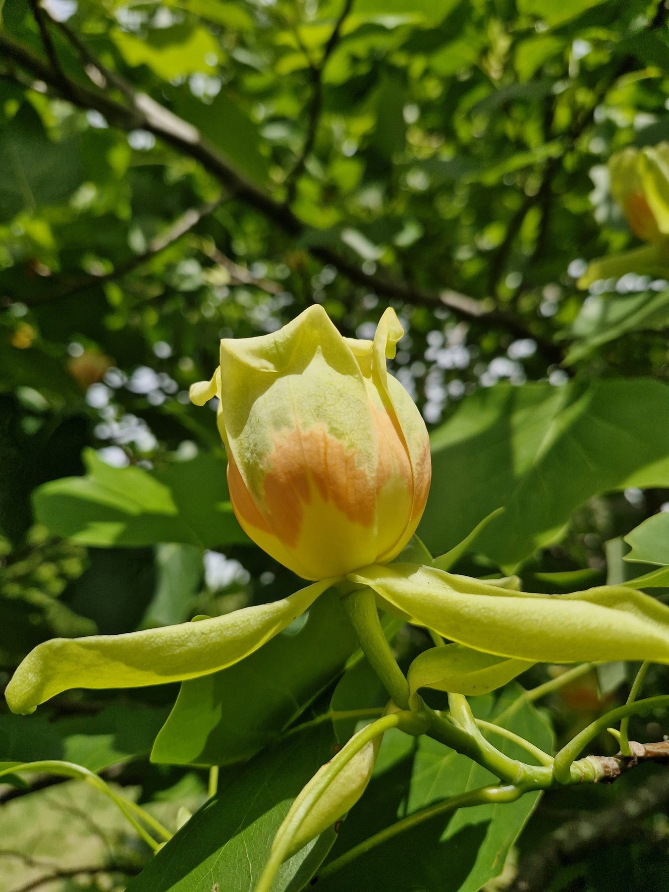
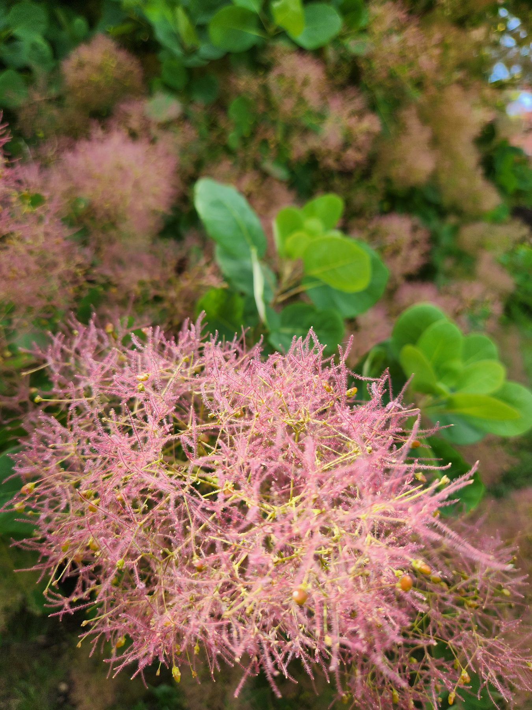

```{r}
#| echo: false
#| message: false
#| warning: false

# Shared loader: gives `arboles` with the same `slug` used by the fichas.
source("scripts/cargar_datos.R")

arboles_destacados <- arboles %>%
  filter(destacado == 1)
```

<!-- # 🌳 Especies destacadas -->

Ejemplares seleccionados por su valor botánico, histórico o paisajístico.

```{=html}
<div class="galeria-dest">
  <figure><figcaption>Liquidámbar en otoño</figcaption></figure>
  <figure><figcaption>Tulipanero en flor</figcaption></figure>
  <figure><figcaption>Árbol de humo (Cotinus)</figcaption></figure>
</div>
```

```{r results='asis', echo=FALSE}

cat("::: {.grid}\n\n")

for (i in seq_len(nrow(arboles_destacados))) {

  a <- arboles_destacados[i, ]

  cat("::: {.g-col-4}\n\n")
  cat("::: {.card .text-center}\n\n")

  # Nombre -> enlace a la ficha generada (mismo slug que generar_fichas.R)
  cat(paste0(
    "####  [", a$nombre_comun, "](fichas/", a$slug, ".qmd)\n\n"
  ))

  # Foto pequeña
  if (tiene_valor(a$foto)) {
    cat(paste0(
      "<div style='text-align:center;'>",
      "{width=150 style='height:150px; object-fit:cover; border-radius:8px;'}",
      "</div>\n\n"
    ))
  }

  # Info mínima
  if (tiene_valor(a$familia)) {
    cat(paste0("**Familia:** ", a$familia, "\n\n"))
  }

  cat(":::\n\n")
  cat(":::\n\n")
}

cat(":::\n")
```
