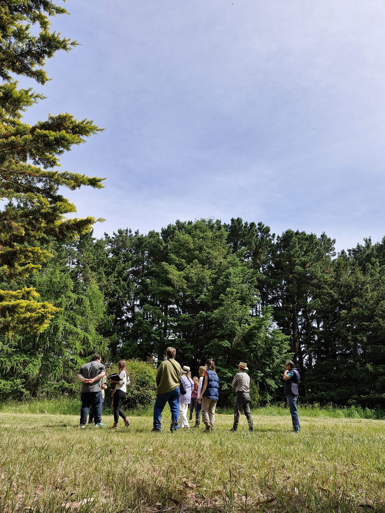
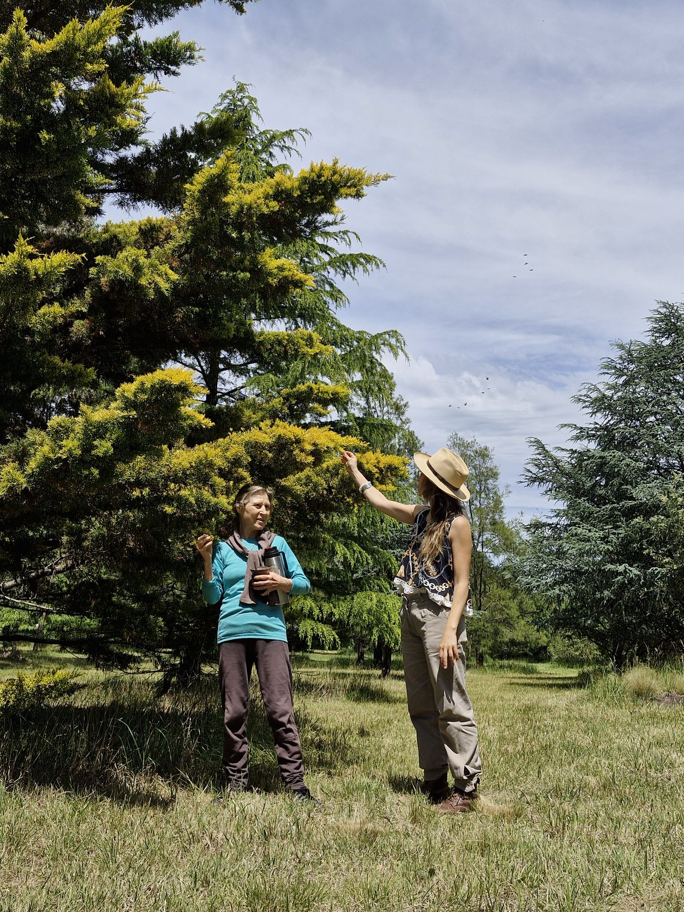
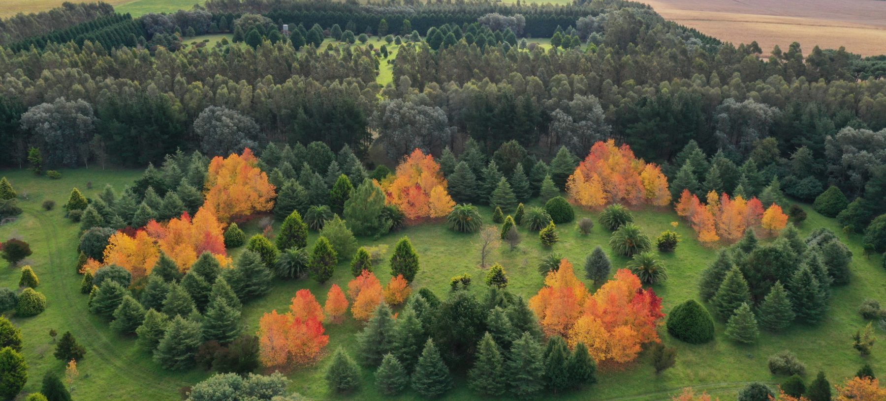

<!-- =========================================================================
  NOTA: revisá y completá antes de publicar los bloques marcados "COMPLETAR"
  (espacios e instalaciones, capacidad, catering/gastronomía, servicios y, si
  querés, valores desde). Están redactados de forma neutra para no comprometer
  algo que todavía no esté definido. Las fotos de instalaciones/eventos reales
  potenciarían mucho esta página: sumalas cuando las tengas.
========================================================================= -->

A pocos minutos de **Mar del Plata**, el Arboretum de Estancia La Constancia ofrece un
entorno natural único —**33 hectáreas** y más de **300 especies** de árboles— para
eventos de empresa que se recuerdan. Un espacio **exclusivo, al aire libre y con
propósito**: cada encuentro puede, además, sumar un impacto ambiental real.

[<i class="bi bi-envelope"></i> Solicitar una propuesta](contacto.qmd){.btn .btn-success .btn-lg role="button"}
&nbsp;
[<i class="bi bi-file-earmark-text"></i> Descargar dossier corporativo](recursos/dossier_empresas.pdf){.btn .btn-outline-success .btn-lg role="button"}

## Ideal para

::: grid

::: {.g-col-12 .g-col-md-6 .card .p-4 .shadow-sm}
### <i class="bi bi-people"></i> Integración y team-building
Jornadas al aire libre para fortalecer equipos, con dinámicas en contacto con la
naturaleza.
:::

::: {.g-col-12 .g-col-md-6 .card .p-4 .shadow-sm}
### <i class="bi bi-compass"></i> Offsites, retiros y reuniones
Encuentros estratégicos, planificación y capacitaciones fuera de la oficina, en un
entorno que inspira.
:::

::: {.g-col-12 .g-col-md-6 .card .p-4 .shadow-sm}
### <i class="bi bi-flower1"></i> Bienestar corporativo
Baños de bosque y actividades de bienestar guiadas para equipos que buscan bajar el
estrés y reconectar.
:::

::: {.g-col-12 .g-col-md-6 .card .p-4 .shadow-sm}
### <i class="bi bi-cup-straw"></i> Celebraciones y brindis
Fin de año, aniversarios, lanzamientos y festejos de empresa en un marco natural
distinto.
:::

::: {.g-col-12 .g-col-md-6 .card .p-4 .shadow-sm}
### <i class="bi bi-mortarboard"></i> Capacitaciones y workshops
Talleres y actividades formativas al aire libre, entre árboles y jardines.
:::

::: {.g-col-12 .g-col-md-6 .card .p-4 .shadow-sm}
### <i class="bi bi-camera"></i> Producciones de foto y video
Locación natural para contenidos institucionales, campañas y sesiones de marca.
:::

:::

## Por qué elegir La Constancia

::: grid

::: {.g-col-12 .g-col-md-4 .card .p-3 .shadow-sm .text-center}
**Entorno único y exclusivo** Un jardín botánico privado de 33 hectáreas, a minutos de Mar del Plata.
:::

::: {.g-col-12 .g-col-md-4 .card .p-3 .shadow-sm .text-center}
**Evento con propósito** Sumá impacto ambiental real y contalo en tu reporte de sustentabilidad.
:::

::: {.g-col-12 .g-col-md-4 .card .p-3 .shadow-sm .text-center}
**A medida** Armamos la propuesta según el objetivo, el tamaño y el estilo de tu equipo.
:::

:::

## El plus con propósito

Lo que nos hace distintos de un salón de eventos: acá tu encuentro puede **dejar
huella**. Combiná tu evento con una actividad de impacto —una **plantación con tu
equipo**, un **baño de bosque**, o el **apadrinamiento de árboles** a nombre de la
empresa— y convertí una jornada en una historia de sostenibilidad concreta,
**trazable y verificable**.

[Conocé la propuesta para empresas →](empresas.qmd){.btn .btn-outline-success role="button"}

## El espacio: al aire libre

Los eventos se realizan **al aire libre**, en el parque y los jardines del arboretum
—amplios, arbolados y con total privacidad—. Es la propuesta ideal para quienes
buscan una experiencia distinta, en plena naturaleza y no en un salón cerrado.

::: {.callout-note}
Por tratarse de una actividad al aire libre, al coordinar el evento definimos una
**fecha principal y una alternativa** por si el clima no acompaña.
:::

<!-- COMPLETAR (opcional): capacidad al aire libre para XX personas · servicios
     disponibles (estacionamiento, sanitarios, electricidad, accesos). -->

## Servicios

<!-- COMPLETAR según lo que ofrezcan realmente -->

- <i class="bi bi-clipboard-check"></i> **Coordinación del evento** y armado a medida.
- <i class="bi bi-cup-hot"></i> **Gastronomía / catering** a convenir. <!-- COMPLETAR: propio, exclusivo, o libre elección -->
- <i class="bi bi-flower2"></i> **Actividades guiadas opcionales**: recorridos botánicos, avistaje de aves, baños de bosque, plantación.
- <i class="bi bi-car-front"></i> **Estacionamiento** en el predio. <!-- COMPLETAR / confirmar -->

## Cómo lo organizamos

::: grid

::: {.g-col-12 .g-col-md-3 .card .p-3 .shadow-sm .text-center}
### 1. Contanos
Nos escribís con la idea, la fecha tentativa y la cantidad de personas.
:::

::: {.g-col-12 .g-col-md-3 .card .p-3 .shadow-sm .text-center}
### 2. Propuesta a medida
Diseñamos el evento —espacio, actividades y logística— según tu objetivo.
:::

::: {.g-col-12 .g-col-md-3 .card .p-3 .shadow-sm .text-center}
### 3. Confirmación
Coordinamos los detalles y aseguramos la fecha.
:::

::: {.g-col-12 .g-col-md-3 .card .p-3 .shadow-sm .text-center}
### 4. El gran día
Tu equipo vive una jornada distinta, en plena naturaleza.
:::

:::

## Galería

::: grid

::: {.g-col-12 .g-col-md-4}
{style="width:100%; height:240px; object-fit:cover; border-radius:12px;"}
:::

::: {.g-col-12 .g-col-md-4}
{style="width:100%; height:240px; object-fit:cover; border-radius:12px;"}
:::

::: {.g-col-12 .g-col-md-4}
{style="width:100%; height:240px; object-fit:cover; border-radius:12px;"}
:::

:::

<!-- Cuando estén disponibles, sumá acá fotos de eventos reales (gente en actividad). -->

## Seguinos en Instagram

Mirá el día a día del arboretum y la estancia en Instagram:

<a href="https://instagram.com/laconstanciadebiocca" target="_blank" rel="noopener" class="btn btn-outline-success" role="button"><i class="bi bi-instagram"></i> @laconstanciadebiocca</a>

## Solicitá una propuesta

Contanos qué tenés en mente y armamos una propuesta a tu medida.

::: {.callout-tip}
**Correo:** [laconstanciaargentina@gmail.com](mailto:laconstanciaargentina@gmail.com)
· **WhatsApp:** [+54 9 11 5736 0940](https://wa.me/5491157360940)

[Solicitar una propuesta](contacto.qmd){.btn .btn-success .btn-lg role="button"}
:::

## Cómo llegar

**Arboretum de Estancia La Constancia** 
Camino 515, Mar del Plata · Buenos Aires · Argentina

<a href="https://maps.app.goo.gl/jQaTGHeaecL4icSg9" target="_blank" rel="noopener" class="btn btn-outline-success" role="button">
<i class="bi bi-geo-alt"></i> Abrir en Google Maps
</a>
