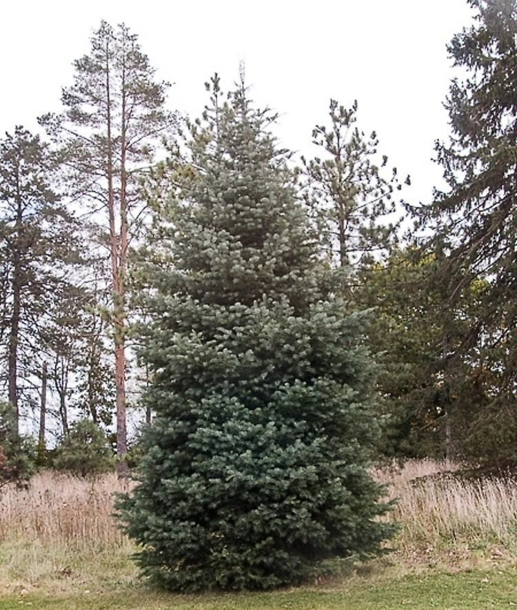

<!-- ARCHIVO GENERADO AUTOMÁTICAMENTE — NO EDITAR A MANO.
     Fuente: data/Arboretum_Master.xlsx (fila ARB014).
     Para cambiar esta página, editá el Excel y volvé a renderizar. -->

---
title: "Abeto"
format: html
---

{style="max-width:320px; border-radius:10px;"}

**Nombre científico:** <i>Abies</i> <i>concolor</i> (Gordon &amp; Glend.) Lindl. ex Hildebr.

**Familia:** Pinaceae

**Origen:** E.E.U.U

**Continente:** América (del Norte y del Sur)

## Ubicación

Coordenadas: -38.056551, -57.679765

[Ver en el mapa »](../mapa.qmd)

## Código QR

{width=130}

Escaneá para abrir esta ficha en el celular.

---

[« Volver a las especies](../especies.qmd)

