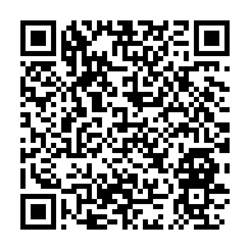

<!-- ARCHIVO GENERADO AUTOMÁTICAMENTE — NO EDITAR A MANO.
     Fuente: data/Arboretum_Master.xlsx (fila ARB058).
     Para cambiar esta página, editá el Excel y volvé a renderizar. -->

---
title: "Acacia mimosa"
format: html
---

**Nombre científico:** <i>Acacia</i> <i>dealbata</i>

**Familia:** Fabaceae

**Origen:** Acacia dealbata

**Continente:** Oceanía (Australia)

## Ubicación

Coordenadas: -38.0559, -57.681743

[Ver en el mapa »](../mapa.qmd)

## Código QR

{width=130}

Escaneá para abrir esta ficha en el celular.

---

[« Volver a las especies](../especies.qmd)

