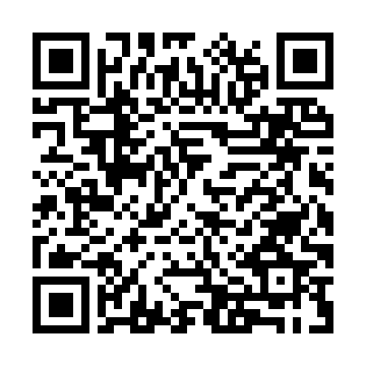

<!-- ARCHIVO GENERADO AUTOMÁTICAMENTE — NO EDITAR A MANO.
     Fuente: data/Arboretum_Master.xlsx (fila ARB068).
     Para cambiar esta página, editá el Excel y volvé a renderizar. -->

---
title: "Boj"
format: html
---

**Nombre científico:** <i>Revisar</i>

**Tipo:** Otro

**Continente:** Europa / Asia / África

## Ubicación

Coordenadas: -38.05508, -57.680938

[Ver en el mapa »](../mapa.qmd)

## Código QR

{width=130}

Escaneá para abrir esta ficha en el celular.

---

[« Volver a las especies](../especies.qmd)

