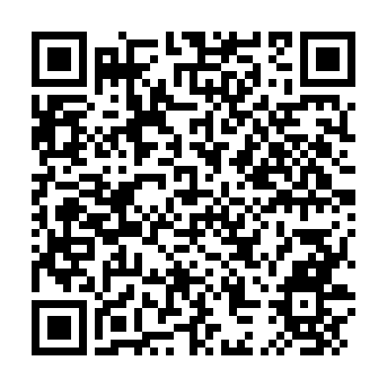

<!-- ARCHIVO GENERADO AUTOMÁTICAMENTE — NO EDITAR A MANO.
     Fuente: data/Arboretum_Master.xlsx (fila ARB006).
     Para cambiar esta página, editá el Excel y volvé a renderizar. -->

---
title: "Casuarina"
format: html
---

**Nombre científico:** <i>Casuarina</i> <i>equisetifolia</i> L.

**Familia:** Casuarinaceae

**Origen:** Australia

**Continente:** Hemisferio Norte / Variable

## Ubicación

Coordenadas: -38.056437, -57.680856

[Ver en el mapa »](../mapa.qmd)

## Código QR

{width=130}

Escaneá para abrir esta ficha en el celular.

---

[« Volver a las especies](../especies.qmd)

