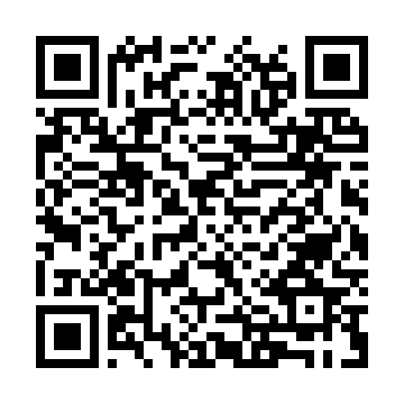

<!-- ARCHIVO GENERADO AUTOMÁTICAMENTE — NO EDITAR A MANO.
     Fuente: data/Arboretum_Master.xlsx (fila ARB055).
     Para cambiar esta página, editá el Excel y volvé a renderizar. -->

---
title: "Cedro"
format: html
---

**Nombre científico:** <i>Cedrus</i> sp.

**Tipo:** Conífera

**Continente:** África / Asia / Europa

## Ubicación

Coordenadas: -38.05572, -57.68198

[Ver en el mapa »](../mapa.qmd)

## Código QR

{width=130}

Escaneá para abrir esta ficha en el celular.

---

[« Volver a las especies](../especies.qmd)

