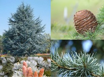

<!-- ARCHIVO GENERADO AUTOMÁTICAMENTE — NO EDITAR A MANO.
     Fuente: data/Arboretum_Master.xlsx (fila ARB009).
     Para cambiar esta página, editá el Excel y volvé a renderizar. -->

---
title: "Cedro azul"
format: html
---

{style="max-width:320px; border-radius:10px;"}

**Nombre científico:** *Cedrus atlantica (Endl.) Manetti ex Carrière*

**Familia:** Pinaceae

**Origen:** África-Europa

**Continente:** África (Norte)

## Ubicación

Coordenadas: -38.056201, -57.680907

[Ver en el mapa »](../mapa.qmd)

---

[« Volver a las especies](../especies.qmd)

