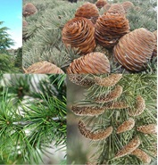

<!-- ARCHIVO GENERADO AUTOMÁTICAMENTE — NO EDITAR A MANO.
     Fuente: data/Arboretum_Master.xlsx (fila ARB005).
     Para cambiar esta página, editá el Excel y volvé a renderizar. -->

---
title: "Cedro del Himalaya"
format: html
---

{style="max-width:320px; border-radius:10px;"}

**Nombre científico:** <i>Cedrus</i> <i>deodara</i> (Roxb. ex D. Don) G. Don

**Familia:** Pinaceae

**Tipo:** Conífera

**Origen:** Asia

**Continente:** Asia

## Ubicación

Coordenadas: -38.056549, -57.680737

[Ver en el mapa »](../mapa.qmd)

## Código QR

{width=130}

Escaneá para abrir esta ficha en el celular.

---

[« Volver a las especies](../especies.qmd)

