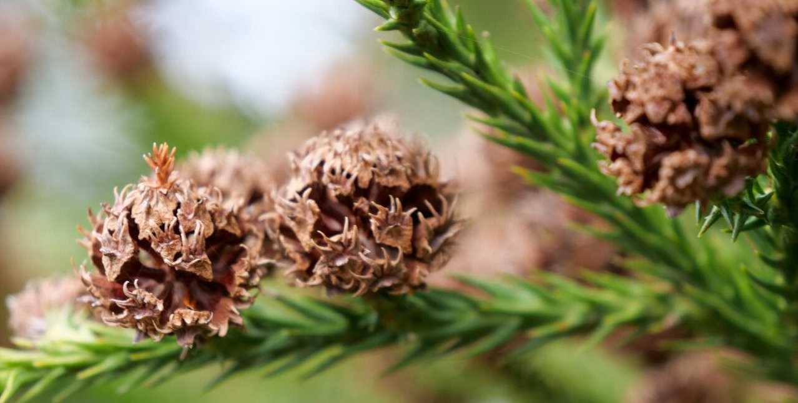

<!-- ARCHIVO GENERADO AUTOMÁTICAMENTE — NO EDITAR A MANO.
     Fuente: data/Arboretum_Master.xlsx (fila ARB032).
     Para cambiar esta página, editá el Excel y volvé a renderizar. -->

---
title: "Cedro japonés"
format: html
---

{style="max-width:320px; border-radius:10px;"}

**Nombre científico:** *Cryptomeria japonica (Thunb. ex L. f.) D. Don*

**Familia:** Cupressaceae

**Origen:** Asia

**Continente:** Asia (Japón)

## Ubicación

Coordenadas: -38.056374, -57.679314

[Ver en el mapa »](../mapa.qmd)

---

[« Volver a las especies](../especies.qmd)

