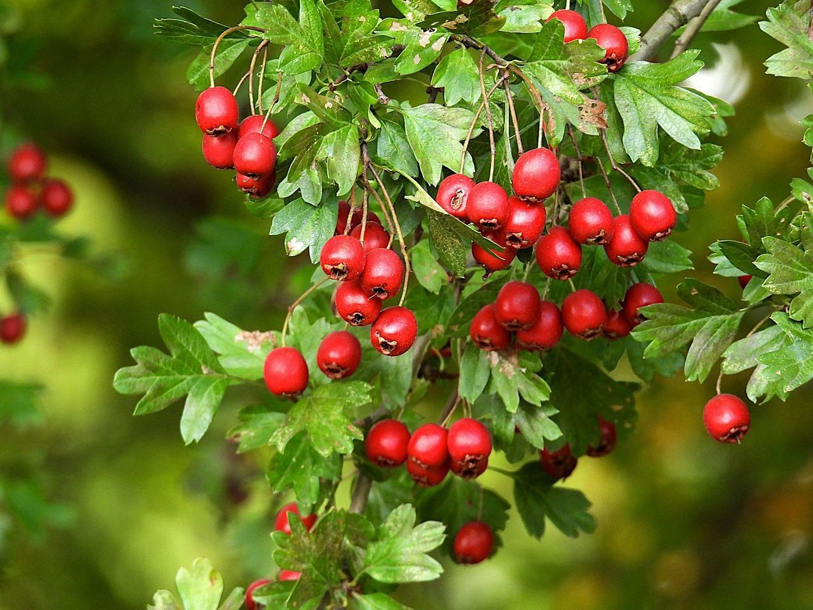

<!-- ARCHIVO GENERADO AUTOMÁTICAMENTE — NO EDITAR A MANO.
     Fuente: data/Arboretum_Master.xlsx (fila ARB018).
     Para cambiar esta página, editá el Excel y volvé a renderizar. -->

---
title: "Crataegus"
format: html
---

{style="max-width:320px; border-radius:10px;"}

**Nombre científico:** *Crataegus sp.*

**Familia:** Rosaceae

**Continente:** Hemisferio Norte / Variable

## Ubicación

Coordenadas: -38.056844, -57.680508

[Ver en el mapa »](../mapa.qmd)

---

[« Volver a las especies](../especies.qmd)

