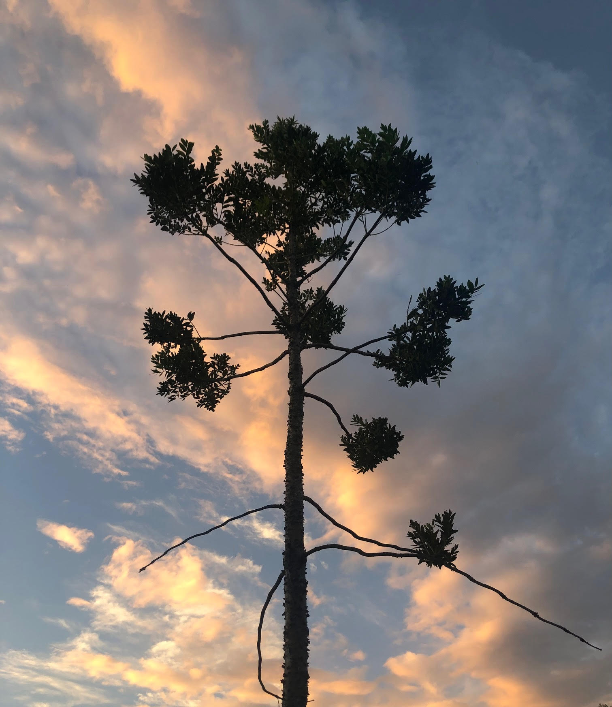

<!-- ARCHIVO GENERADO AUTOMÁTICAMENTE — NO EDITAR A MANO.
     Fuente: data/Arboretum_Master.xlsx (fila ARB041).
     Para cambiar esta página, editá el Excel y volvé a renderizar. -->

---
title: "Damara"
format: html
---

{style="max-width:320px; border-radius:10px;"}

**Nombre científico:** *Agathis dammara*

**Familia:** Araucariaceae

**Continente:** Asia (Sudeste Asiático)

---

[« Volver a las especies](../especies.qmd)

