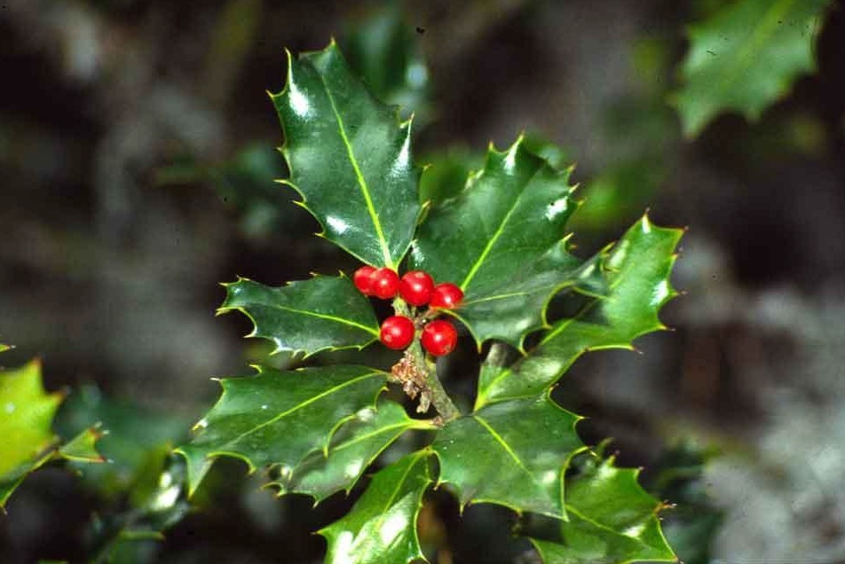
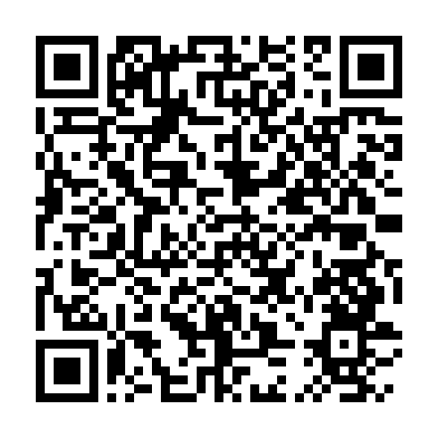

<!-- ARCHIVO GENERADO AUTOMÁTICAMENTE — NO EDITAR A MANO.
     Fuente: data/Arboretum_Master.xlsx (fila ARB004).
     Para cambiar esta página, editá el Excel y volvé a renderizar. -->

---
title: "Falso muérdago"
format: html
---

{style="max-width:320px; border-radius:10px;"}

**Nombre científico:** <i>Ilex</i> <i>aquifolium</i> L.

**Tipo:** Árbol latifoliado

**Origen:** Europa

**Continente:** Europa / África del Norte / Asia

## Ubicación

Coordenadas: -38.056569, -57.680685

[Ver en el mapa »](../mapa.qmd)

## Código QR

{width=130}

Escaneá para abrir esta ficha en el celular.

---

[« Volver a las especies](../especies.qmd)

