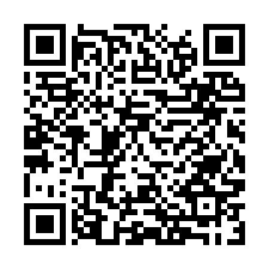

<!-- ARCHIVO GENERADO AUTOMÁTICAMENTE — NO EDITAR A MANO.
     Fuente: data/Arboretum_Master.xlsx (fila ARB076).
     Para cambiar esta página, editá el Excel y volvé a renderizar. -->

---
title: "Ginkgo"
format: html
---

**Nombre científico:** <i>Ginkgo</i> <i>biloba</i> L.

**Familia:** Ginkgoaceae

**Tipo:** Otro

**Origen:** Asia

**Continente:** Asia (China)

## Ubicación

Coordenadas: -38.056, -57.681529

[Ver en el mapa »](../mapa.qmd)

## Código QR

{width=130}

Escaneá para abrir esta ficha en el celular.

---

[« Volver a las especies](../especies.qmd)

