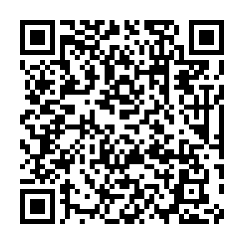

<!-- ARCHIVO GENERADO AUTOMÁTICAMENTE — NO EDITAR A MANO.
     Fuente: data/Arboretum_Master.xlsx (fila ARB039).
     Para cambiar esta página, editá el Excel y volvé a renderizar. -->

---
title: "Hipericón canario"
format: html
---

**Nombre científico:** <i>Hypericum</i> <i>×moserianum</i> André

**Familia:** Hypericaceae

**Tipo:** Arbusto

**Continente:** África (Islas Canarias)

## Código QR

{width=130}

Escaneá para abrir esta ficha en el celular.

---

[« Volver a las especies](../especies.qmd)

