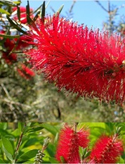

<!-- ARCHIVO GENERADO AUTOMÁTICAMENTE — NO EDITAR A MANO.
     Fuente: data/Arboretum_Master.xlsx (fila ARB016).
     Para cambiar esta página, editá el Excel y volvé a renderizar. -->

---
title: "Limpiatubos"
format: html
---

{style="max-width:320px; border-radius:10px;"}

**Nombre científico:** <i>Callistemon</i> <i>imperialis</i>

**Familia:** Myrtaceae

**Tipo:** Arbusto

**Origen:** Australia

**Continente:** América del Sur

**Año de plantación:** 1988

## Ubicación

Coordenadas: -38.056727, -57.679967

[Ver en el mapa »](../mapa.qmd)

## Código QR

{width=130}

Escaneá para abrir esta ficha en el celular.

---

[« Volver a las especies](../especies.qmd)

