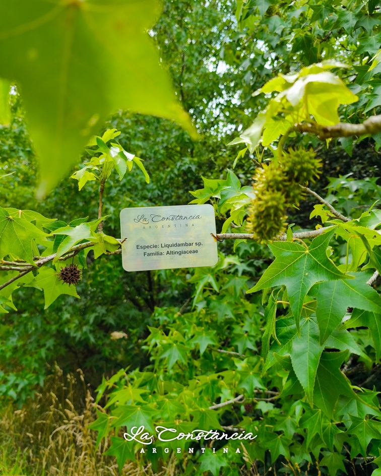

<!-- ARCHIVO GENERADO AUTOMÁTICAMENTE — NO EDITAR A MANO.
     Fuente: data/Arboretum_Master.xlsx (fila ARB062).
     Para cambiar esta página, editá el Excel y volvé a renderizar. -->

---
title: "Liquidámbar de Formosa"
format: html
---

{style="max-width:320px; border-radius:10px;"}

**Nombre científico:** <i>Liquidambar</i> <i>formosana</i>

**Familia:** Altingiaceae

**Origen:** Asia

**Continente:** Asia (China / Taiwán)

## Ubicación

Coordenadas: -38.05553, -57.681601

[Ver en el mapa »](../mapa.qmd)

## Código QR

{width=130}

Escaneá para abrir esta ficha en el celular.

---

[« Volver a las especies](../especies.qmd)

