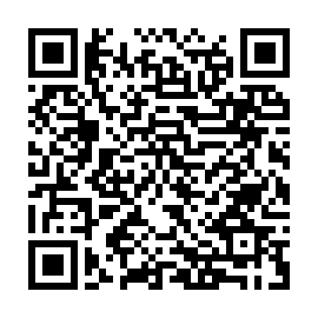

<!-- ARCHIVO GENERADO AUTOMÁTICAMENTE — NO EDITAR A MANO.
     Fuente: data/Arboretum_Master.xlsx (fila ARB033).
     Para cambiar esta página, editá el Excel y volvé a renderizar. -->

---
title: "Liquidambar"
format: html
---

**Nombre científico:** *Liquidambar sp.*

**Familia:** Altingiaceae

**Continente:** América del Norte / Asia

## Ubicación

Coordenadas: -38.056545, -57.679395

[Ver en el mapa »](../mapa.qmd)

## Código QR

{width=130}

Escaneá para abrir esta ficha en el celular.

---

[« Volver a las especies](../especies.qmd)

