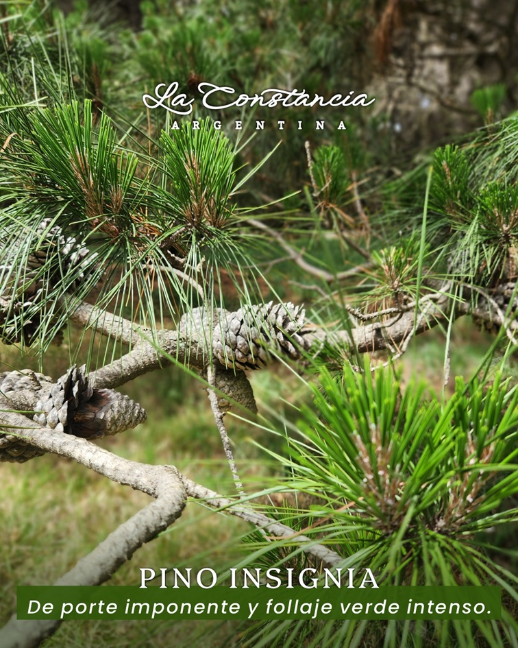

<!-- ARCHIVO GENERADO AUTOMÁTICAMENTE — NO EDITAR A MANO.
     Fuente: data/Arboretum_Master.xlsx (fila ARB071).
     Para cambiar esta página, editá el Excel y volvé a renderizar. -->

---
title: "Pino insigne"
format: html
---

{style="max-width:320px; border-radius:10px;"}

**Nombre científico:** <i>Pinus</i> <i>radiata</i> D.Don

**Familia:** Pinaceae

**Tipo:** Conífera

**Origen:** Norte América

**Continente:** América del Norte

## Ubicación

Coordenadas: -38.05532, -57.680429

[Ver en el mapa »](../mapa.qmd)

## Código QR

{width=130}

Escaneá para abrir esta ficha en el celular.

---

[« Volver a las especies](../especies.qmd)

