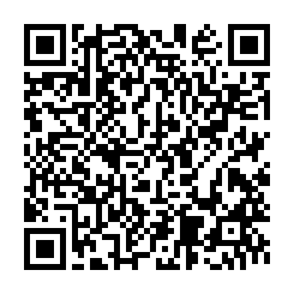

<!-- ARCHIVO GENERADO AUTOMÁTICAMENTE — NO EDITAR A MANO.
     Fuente: data/Arboretum_Master.xlsx (fila ARB043).
     Para cambiar esta página, editá el Excel y volvé a renderizar. -->

---
title: "Roble rojo"
format: html
---

**Nombre científico:** *Quercus rubra L.*

**Familia:** Fagaceae

**Origen:** Europa

**Continente:** América del Norte

## Ubicación

Coordenadas: -38.0558, -57.682849

[Ver en el mapa »](../mapa.qmd)

## Código QR

{width=130}

Escaneá para abrir esta ficha en el celular.

---

[« Volver a las especies](../especies.qmd)

