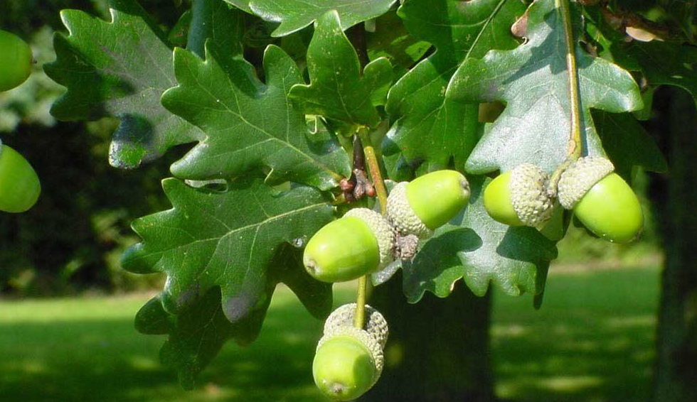

<!-- ARCHIVO GENERADO AUTOMÁTICAMENTE — NO EDITAR A MANO.
     Fuente: data/Arboretum_Master.xlsx (fila ARB003).
     Para cambiar esta página, editá el Excel y volvé a renderizar. -->

---
title: "Roble común"
format: html
---

{style="max-width:320px; border-radius:10px;"}

**Nombre científico:** *Quercus robur L.*

**Familia:** Fagaceae

**Origen:** Europa

**Continente:** Europa / Asia Occidental

## Ubicación

Coordenadas: -38.056541, -57.680555

[Ver en el mapa »](../mapa.qmd)

---

[« Volver a las especies](../especies.qmd)

