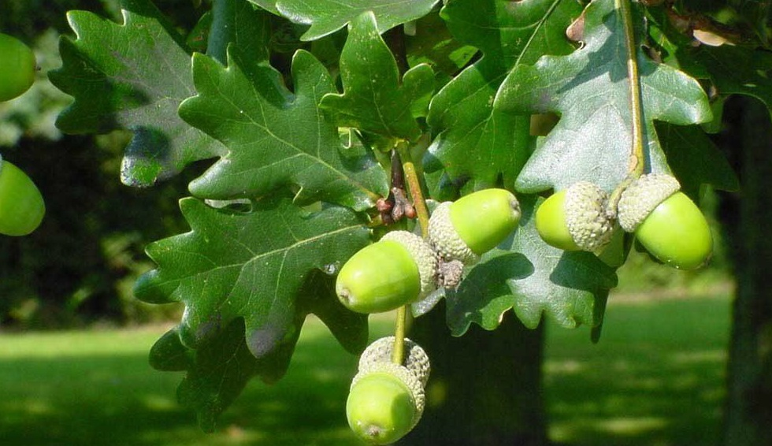

<!-- ARCHIVO GENERADO AUTOMÁTICAMENTE — NO EDITAR A MANO.
     Fuente: data/Arboretum_Master.xlsx (fila ARB003).
     Para cambiar esta página, editá el Excel y volvé a renderizar. -->

---
title: "Roble común"
format: html
---

{style="max-width:320px; border-radius:10px;"}

**Nombre científico:** <i>Quercus</i> <i>robur</i> L.

**Familia:** Fagaceae

**Tipo:** Árbol latifoliado

**Origen:** Europa

**Continente:** Europa / Asia Occidental

**Estado de conservación (UICN):** LC · Preocupación menor  
Categoría global de la especie · [Lista Roja UICN](https://www.iucnredlist.org)

## Ubicación

Coordenadas: -38.056541, -57.680555

[Ver en el mapa »](../mapa.qmd)

## Código QR

{width=130}

Escaneá para abrir esta ficha en el celular.

---

[« Volver a las especies](../especies.qmd)

