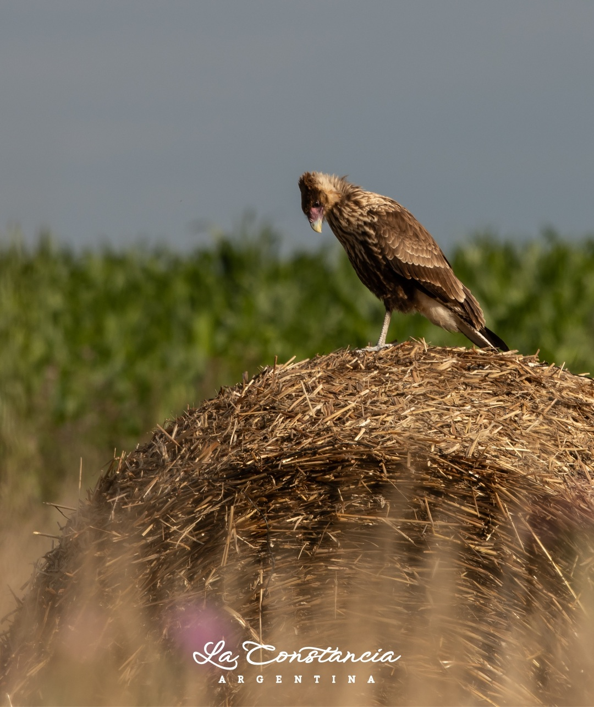
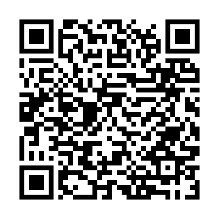

<!-- ARCHIVO GENERADO AUTOMÁTICAMENTE — NO EDITAR A MANO.
     Fuente: data/Arboretum_Master.xlsx (fila ARB001).
     Para cambiar esta página, editá el Excel y volvé a renderizar. -->

---
title: "Sabina de Virginia"
format: html
---

{style="max-width:320px; border-radius:10px;"}

**Nombre científico:** *Sabina virginiana (L.) Antoine*

**Familia:** Cupressaceae

**Origen:** E.E.U.U

**Continente:** América del Norte

**Año de plantación:** 2004

## Ubicación

Coordenadas: -38.056791, -57.680154

[Ver en el mapa »](../mapa.qmd)

## Código QR

{width=130}

Escaneá para abrir esta ficha en el celular.

---

[« Volver a las especies](../especies.qmd)

