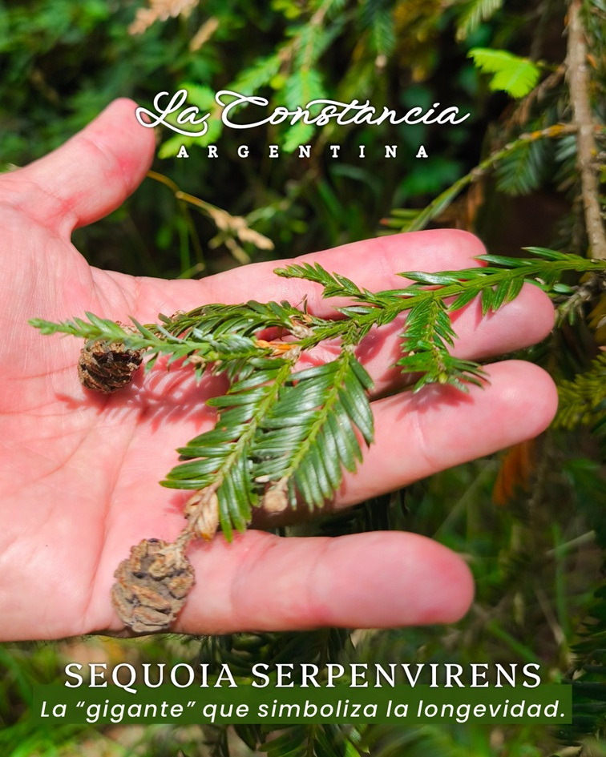

<!-- ARCHIVO GENERADO AUTOMÁTICAMENTE — NO EDITAR A MANO.
     Fuente: data/Arboretum_Master.xlsx (fila ARB034).
     Para cambiar esta página, editá el Excel y volvé a renderizar. -->

---
title: "Secuoya roja"
format: html
---

{style="max-width:320px; border-radius:10px;"}

**Nombre científico:** <i>Sequoiadendron</i> <i>giganteum</i>

**Familia:** Cupressaceae

**Tipo:** Conífera

**Continente:** América del Norte

**Estado de conservación (UICN):** EN · En peligro  
Categoría global de la especie · [Lista Roja UICN](https://www.iucnredlist.org)

## Código QR

{width=130}

Escaneá para abrir esta ficha en el celular.

---

[« Volver a las especies](../especies.qmd)

