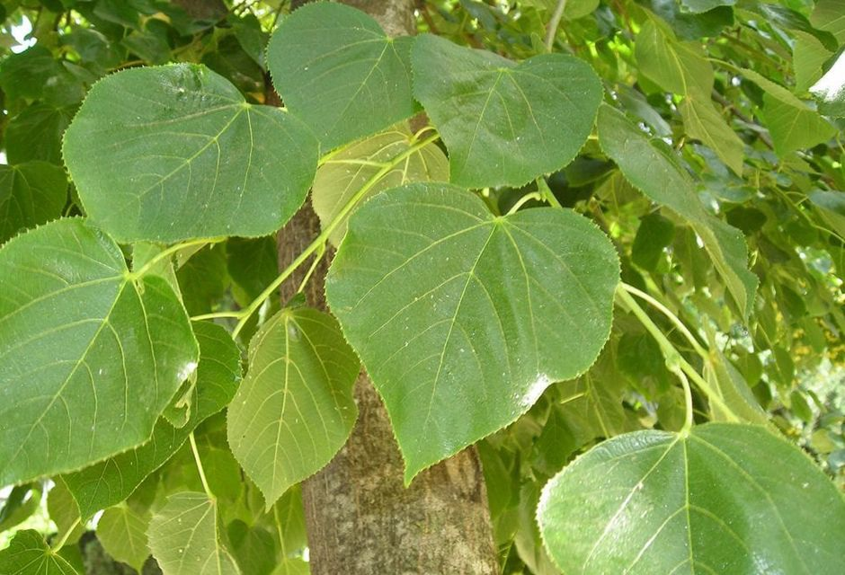

<!-- ARCHIVO GENERADO AUTOMÁTICAMENTE — NO EDITAR A MANO.
     Fuente: data/Arboretum_Master.xlsx (fila ARB021).
     Para cambiar esta página, editá el Excel y volvé a renderizar. -->

---
title: "Tilo"
format: html
---

{style="max-width:320px; border-radius:10px;"}

**Nombre científico:** *Tilia sp.*

**Familia:** Malvaceae

**Continente:** Hemisferio Norte / Variable

**Año de plantación:** 1990

## Ubicación

Coordenadas: -38.057192, -57.680583

[Ver en el mapa »](../mapa.qmd)

---

[« Volver a las especies](../especies.qmd)

