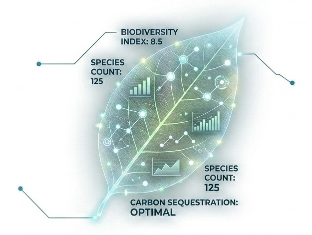

<!-- # 🌿 Laboratorio del Arboretum -->

Bienvenidos al Laboratorio del Arboretum de Estancia La Constancia.

Este espacio reúne información sobre las especies vegetales, aves y principales puntos de interés relevados en el establecimiento. El objetivo es documentar y difundir el patrimonio natural del arboretum mediante herramientas de observación, monitoreo y divulgación científica.

{fig-align="center" .rounded .shadow-sm alt="Panel del Arboretum Data Lab"}

<!-- 
 -->
<!--    -->
<!-- 
 -->

<!-- ## Explorar -->

<!-- ::: grid -->
<!-- ::: g-col-4 -->
<!-- ### 🌳 Especies destacadas -->

<!-- Conozca los ejemplares más representativos de la flora del arboretum, incluyendo árboles de gran interés botánico, paisajístico e histórico. -->

<!-- [Explorar especies →](especies.qmd){.btn .btn-success .btn-sm role="button"} -->
<!-- ::: -->

<!-- ::: g-col-4 -->
<!-- ### 🐦 Aves -->

<!-- Galería fotográfica de aves registradas en Estancia La Constancia a través de actividades de monitoreo y observación de fauna. -->

<!-- [Explorar aves →](aves.qmd){.btn .btn-success .btn-sm role="button"} -->
<!-- ::: -->

<!-- ::: g-col-4 -->
<!-- ### 📍 Mapa interactivo -->

<!-- Recorra virtualmente los senderos, sectores y puntos de interés del arboretum. -->

<!-- [Explorar mapa →](mapa.qmd){.btn .btn-success .btn-sm role="button"} -->
<!-- ::: -->
<!-- ::: -->

## Explorar

::: grid

::: {.g-col-4 .card .p-3 .shadow-sm .text-center}
### 🌳 Flora Destacada
Conozca los ejemplares más representativos de la flora del arboretum, de gran interés botánico e histórico.

[Explorar especies →](especies.qmd){.btn .btn-outline-success .btn-sm .mt-auto role="button"}
:::

::: {.g-col-4 .card .p-3 .shadow-sm .text-center}
### 🐦 Aves
Galería fotográfica y registro de estacionalidad de las aves observadas en el establecimiento.

[Explorar aves →](aves.qmd){.btn .btn-outline-success .btn-sm .mt-auto role="button"}
:::

::: {.g-col-4 .card .p-3 .shadow-sm .text-center style="border-top: 3px solid #1E4A38;"}
### 📍 Mapa Interactivo
Recorra virtualmente los senderos, sectores y puntos de interés en tiempo real.

[Ver Mapa →](mapa.qmd){.btn .btn-success .btn-sm .mt-auto role="button"}
:::

:::

---

::: grid
::: g-col-7
## Acerca del Laboratorio
El Laboratorio del Arboretum integra los relevamientos biológicos desarrollados en Estancia La Constancia para promover la conservación, investigación y educación ambiental de la biodiversidad local.
:::

::: g-col-5
## Créditos
Las fotografías y relevamientos incluidos en este sitio fueron realizados por los equipos de biólogos y ecólogos que desarrollan actividades de monitoreo en el establecimiento.
:::
:::