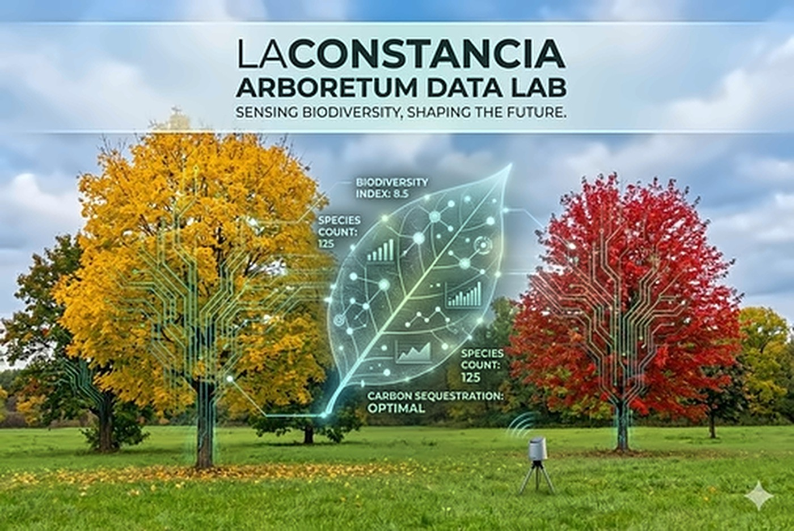

```{r}
#| label: setup
source("scripts/cargar_datos.R")

destacados <- arboles %>%
  dplyr::filter(destacado == 1, tiene_valor(foto)) %>%
  dplyr::arrange(nombre_comun)
```

<!-- # 🌿 Laboratorio del Arboretum -->

Bienvenidos al Laboratorio del Arboretum de Estancia La Constancia.

Este espacio reúne información sobre las especies vegetales, aves y principales puntos de interés relevados en el establecimiento. El objetivo es documentar y difundir el patrimonio natural del arboretum mediante herramientas de observación, monitoreo y divulgación científica.

<div style="text-align: center; margin-bottom: 2rem;">
  
</div>

## Ejemplares destacados

```{r results='asis'}
cat('<div class="grid">')
for (i in seq_len(min(4, nrow(destacados)))) {
  d <- destacados[i, ]
  cat(sprintf('<div class="g-col-3 card text-center shadow-sm m-1" style="overflow:hidden;"><a href="fichas/%s.html" style="text-decoration:none;color:inherit;"><div class="p-2"><b>%s</b></div></a></div>',
    d$slug, d$foto, d$nombre_comun))
}
cat('</div>')
```

## Explorar

::: grid

::: {.g-col-4 .card .p-3 .shadow-sm .text-center}
### 🌳 Flora Destacada
Conozca los ejemplares más representativos de la flora del arboretum, de gran interés botánico e histórico.

[Explorar especies →](especies.qmd){.btn .btn-outline-success .btn-sm .mt-auto role="button"}
:::

::: {.g-col-4 .card .p-3 .shadow-sm .text-center}
### 🐦 Aves
Galería fotográfica y registro de estacionalidad de las aves observadas en el establecimiento.

[Explorar aves →](aves.qmd){.btn .btn-outline-success .btn-sm .mt-auto role="button"}
:::

::: {.g-col-4 .card .p-3 .shadow-sm .text-center style="border-top: 3px solid #1E4A38;"}
### 📍 Mapa Interactivo
Recorra virtualmente los senderos, sectores y puntos de interés en tiempo real.

[Ver Mapa →](mapa.qmd){.btn .btn-success .btn-sm .mt-auto role="button"}
:::

:::

---

::: grid
::: g-col-7
## Acerca del Laboratorio
El Laboratorio del Arboretum integra los relevamientos biológicos desarrollados en Estancia La Constancia para promover la conservación, investigación y educación ambiental de la biodiversidad local.
:::

::: g-col-5
## Créditos
Las fotografías y relevamientos incluidos en este sitio fueron realizados por los equipos de biólogos y ecólogos que desarrollan actividades de monitoreo en el establecimiento.
:::
:::
