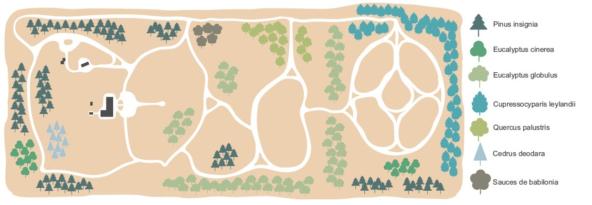
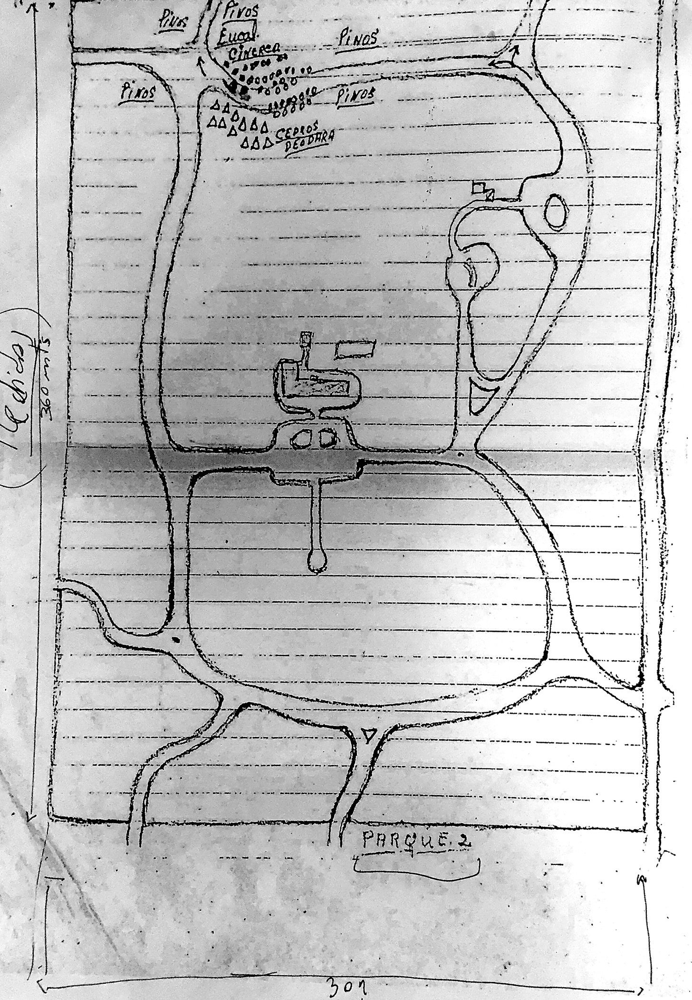
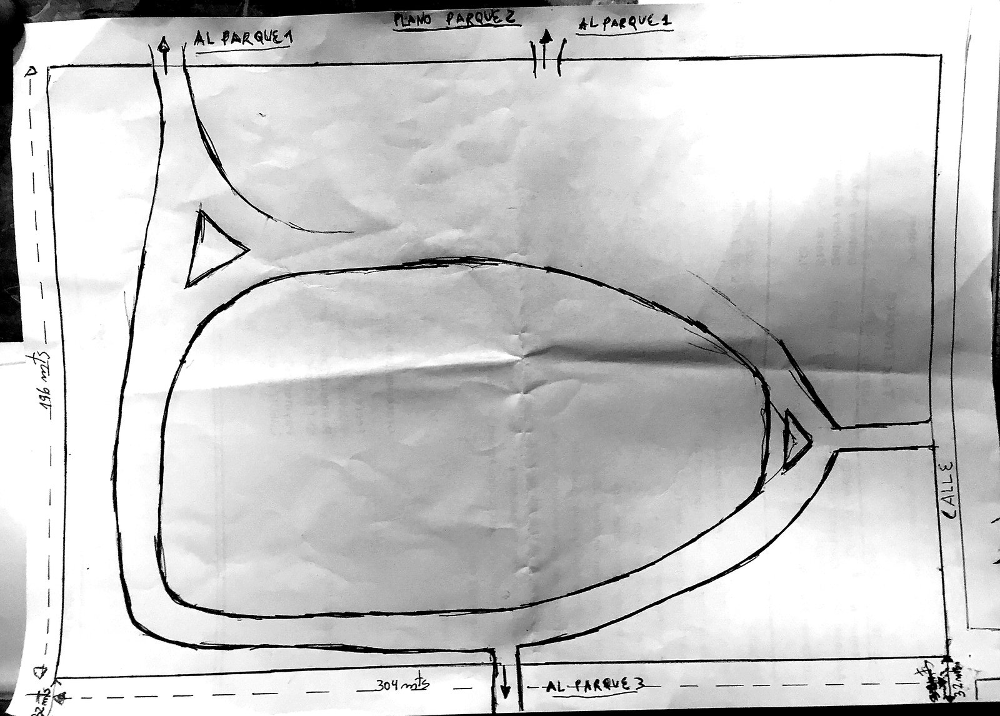
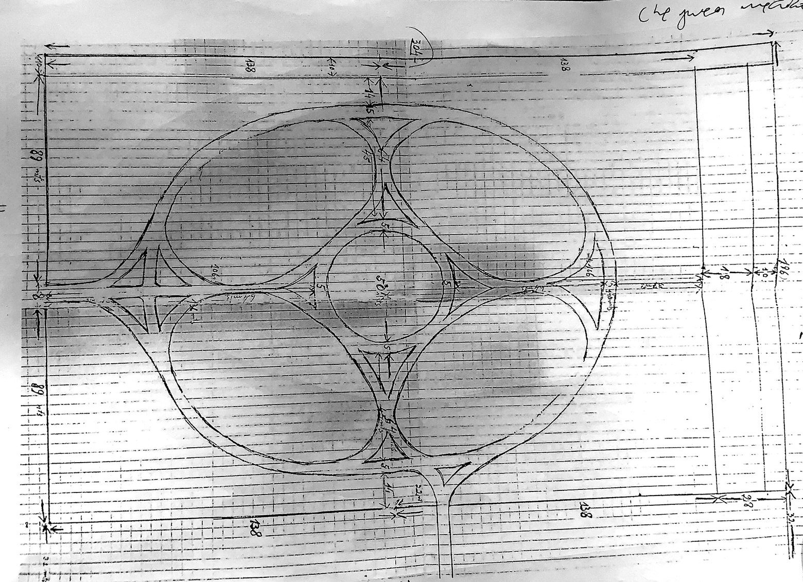

Recorré el arboretum con este plano ilustrado, que muestra la distribución de las
principales colecciones y los senderos del predio. La referencia de especies está
a la derecha del plano.

<div style="text-align:center; margin:1.5rem 0;">
  
</div>

¿Preferís explorar ejemplar por ejemplar, con fotos y fichas? Visitá el
[mapa interactivo »](mapa.qmd).

## Los planos originales del fundador

Antes de que existiera este atlas digital, el arboretum nació del lápiz y la tinta
de su fundador, que dibujó a mano los primeros planos de cada sector del parque:
dónde iría cada grupo de árboles, cómo se trazarían los senderos y con qué medidas.
Estos son aquellos bocetos originales, conservados como parte de la historia del lugar.

::: {.callout-tip}
Hacé clic en cada plano para verlo en grande y leer las anotaciones del fundador.
:::

```{=html}
<style>
  .planos-galeria{display:flex;flex-wrap:wrap;gap:1.6rem;justify-content:center;align-items:flex-start;margin:1.6rem 0;}
  .plano-card{background:#f7f5ef;border:1px solid #e0dccf;border-radius:8px;padding:.6rem;box-shadow:0 4px 16px rgba(0,0,0,.12);max-width:330px;}
  .plano-card img{width:100%;height:auto;border-radius:4px;cursor:zoom-in;display:block;}
  .plano-card figcaption{font-size:.85rem;color:#555;margin-top:.55rem;line-height:1.4;}
  .plano-card figcaption strong{color:#1E4A38;}
  #lb-overlay{display:none;position:fixed;inset:0;background:rgba(0,0,0,.86);z-index:9999;align-items:center;justify-content:center;cursor:zoom-out;padding:2vh;}
  #lb-overlay img{max-width:95vw;max-height:90vh;box-shadow:0 8px 40px rgba(0,0,0,.5);border-radius:4px;}
  #lb-cap{position:absolute;bottom:1.1rem;left:0;right:0;text-align:center;color:#eee;font-size:.9rem;padding:0 1rem;}
  #lb-close{position:absolute;top:.8rem;right:1.3rem;color:#fff;font-size:2.2rem;line-height:1;cursor:pointer;}
</style>

<div class="planos-galeria">
  <figure class="plano-card">
    
    <figcaption><strong>Parque 1</strong> — El esquema de plantación: los grupos de especies anotados a mano (pinos, cedros deodara, cipreses y más).</figcaption>
  </figure>
  <figure class="plano-card">
    
    <figcaption><strong>Parque 2</strong> — El trazado de senderos y su conexión con los parques 1 y 3 (304 × 190 m).</figcaption>
  </figure>
  <figure class="plano-card">
    
    <figcaption><strong>Parque 3</strong> — El diseño geométrico del sector, con sus medidas al detalle sobre papel cuadriculado.</figcaption>
  </figure>
</div>

<div id="lb-overlay">
  <span id="lb-close">&times;</span>
  
  <div id="lb-cap"></div>
</div>

<script>
(function(){
  var ov=document.getElementById("lb-overlay"),
      im=document.getElementById("lb-img"),
      cap=document.getElementById("lb-cap");
  document.querySelectorAll(".plano-zoom").forEach(function(t){
    t.addEventListener("click",function(){
      im.src=t.getAttribute("src"); im.alt=t.getAttribute("alt");
      cap.textContent=t.getAttribute("data-cap")||"";
      ov.style.display="flex";
    });
  });
  function cerrar(){ ov.style.display="none"; im.src=""; }
  ov.addEventListener("click",cerrar);
  document.addEventListener("keydown",function(e){ if(e.key==="Escape") cerrar(); });
})();
</script>
```

**Del plano al jardín de hoy.** Aquellos trazos a mano se convirtieron en el
arboretum que hoy podés recorrer: mirá cómo quedó en el plano ilustrado de arriba y
explorá cada ejemplar, con fotos y fichas, en el [mapa interactivo »](mapa.qmd).
