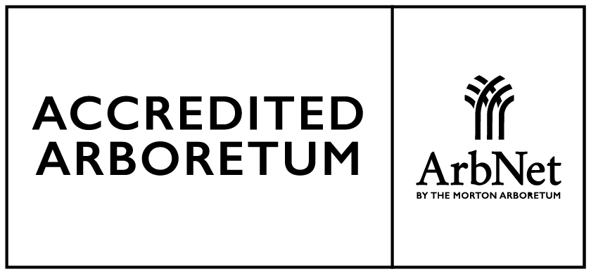

```{=html}
<style>
/* =====================================================
   ESTILOS PROPIOS DE ESTA PÁGINA (Visitas escolares)
   Van embebidos aquí para que solo afecten a esta página
   y no al resto del sitio. Paleta y tipografía elegantes.
===================================================== */

@import url('https://fonts.googleapis.com/css2?family=Cormorant+Garamond:wght@400;500;600;700&family=Inter:wght@300;400;500;600&display=swap');

:root {
  --forest: #173828;
  --forest-soft: #2d5a40;
  --moss: #6b8f71;
  --sage: #b7c9b0;
  --cream: #f7f5ef;
  --warm-white: #fcfbf8;
  --text: #2b2b2b;
  --muted: #5f6b63;
}

body {
  font-family: 'Inter', sans-serif;
  background-color: var(--warm-white);
  color: var(--text);
  line-height: 1.8;
  font-size: 1.05rem;
}

/* Quitar el padding lateral de Quarto para el hero a lo ancho */
.page-columns,
.page-full,
.content,
#quarto-content {
  padding-left: 0 !important;
  padding-right: 0 !important;
  margin-left: 0 !important;
  margin-right: 0 !important;
  max-width: 100% !important;
}

/* ---------- HERO ---------- */
.hero-banner {
  position: relative;
  width: 100%;
  height: auto;
  min-height: 82vh;
  margin: 0 0 4rem 0;
  background-image:
    linear-gradient(rgba(0,0,0,0.35), rgba(0,0,0,0.55)),
    url('fotos/fotobanner.jpg');
  background-size: cover;
  background-position: center center;
  background-repeat: no-repeat;
  overflow: visible;
}
.hero-overlay {
  width: 100%;
  height: 100%;
  display: flex;
  align-items: center;
  justify-content: center;
  padding-top: 4rem;
  padding-bottom: 3rem;
}
.hero-content {
  text-align: center;
  color: white;
  max-width: 950px;
  z-index: 10;
  padding: 4rem 1rem;
  display: flex;
  flex-direction: column;
  justify-content: flex-start;
}
.hero-content h1 {
  font-family: 'Cormorant Garamond', serif;
  font-size: clamp(3rem, 8vw, 6rem);
  font-weight: 600;
  line-height: 1;
  margin-bottom: 1rem;
  letter-spacing: 0.01em;
  text-shadow: 0 4px 20px rgba(0,0,0,0.45);
  color: #fff;
}
.hero-content h3 {
  font-family: 'Inter', sans-serif;
  font-size: clamp(1.1rem, 2vw, 1.8rem);
  font-weight: 300;
  margin-bottom: 1.5rem;
  color: rgba(255,255,255,0.92);
  text-shadow: 0 2px 10px rgba(0,0,0,0.35);
}
.hero-logo {
  width: 230px;
  max-width: 60%;
  margin: 1rem auto 2rem auto;
  filter: drop-shadow(0 4px 10px rgba(0,0,0,0.35));
  opacity: 0.96;
}

/* ---------- CONTENIDO ---------- */
main.content {
  max-width: 1100px !important;
  margin: auto !important;
  padding-left: 2rem !important;
  padding-right: 2rem !important;
}
.lead-text {
  max-width: 950px;
  margin: auto auto 4rem auto;
  font-size: 1.35rem;
  line-height: 1.9;
  color: var(--muted);
  padding-left: 1.5rem;
  border-left: 3px solid var(--forest-soft);
}
.justificado {
  text-align: justify;
  text-justify: inter-word;
}

/* ---------- TÍTULOS ---------- */
main.content h2 {
  font-family: 'Cormorant Garamond', serif;
  font-size: 3rem;
  font-weight: 600;
  color: var(--forest);
  margin-top: 5rem;
  margin-bottom: 2rem;
  position: relative;
}
main.content h2::after {
  content: "";
  position: absolute;
  left: 0;
  bottom: -12px;
  width: 90px;
  height: 2px;
  background: linear-gradient(90deg, var(--forest-soft), var(--sage));
}
main.content h3 {
  font-family: 'Cormorant Garamond', serif;
  color: var(--forest-soft);
  font-size: 1.8rem;
  font-weight: 600;
  margin-top: 2rem;
  margin-bottom: 1rem;
}
main.content h4 {
  font-family: 'Inter', sans-serif;
  color: var(--forest);
  font-weight: 600;
}

/* ---------- TABSET ---------- */
.nav-tabs {
  border-bottom: 1px solid rgba(23, 56, 40, 0.12);
  margin-bottom: 1.2rem;
  gap: 0.4rem;
}
.nav-tabs .nav-link {
  color: rgba(23, 56, 40, 0.70) !important;
  font-weight: 600;
  border: 1px solid rgba(23, 56, 40, 0.15);
  border-radius: 999px;
  padding: 0.65rem 1.25rem;
  margin-right: 0.4rem;
  background: rgba(255, 255, 255, 0.7);
  transition: all 0.25s ease;
  backdrop-filter: blur(6px);
  letter-spacing: 0.01em;
}
.nav-tabs .nav-link:hover {
  color: var(--forest) !important;
  background: rgba(45, 90, 64, 0.10);
  border-color: rgba(45, 90, 64, 0.35);
  transform: translateY(-1px);
}
.nav-tabs .nav-link.active {
  background: var(--forest) !important;
  color: white !important;
  border-color: var(--forest) !important;
  box-shadow: 0 8px 20px rgba(23, 56, 40, 0.25);
  transform: translateY(-1px);
}
.nav-tabs .nav-link:focus {
  outline: 2px solid var(--moss);
  outline-offset: 2px;
}
.tab-content {
  padding: 2.2rem;
  background: white;
  border-radius: 16px;
  border: 1px solid rgba(23, 56, 40, 0.08);
  box-shadow: 0 12px 30px rgba(0,0,0,0.04);
  margin-top: 0.5rem;
}

/* ---------- BOTONES / CTA ---------- */
.cta-container {
  text-align: center;
  margin-top: 2rem;
  margin-bottom: 4rem;
}
.cta-button {
  display: inline-block;
  background: var(--forest);
  color: white !important;
  padding: 1rem 2.5rem;
  border-radius: 999px;
  text-decoration: none;
  font-weight: 600;
  letter-spacing: 0.03em;
  transition: all 0.3s ease;
  box-shadow: 0 8px 20px rgba(23,56,40,0.18);
}
.cta-button:hover {
  background: #0e2419;
  transform: translateY(-2px);
  box-shadow: 0 12px 28px rgba(23,56,40,0.28);
  text-decoration: none;
}
.download-label {
  margin-top: 2rem;
  margin-bottom: 0.6rem;
  color: var(--forest);
}
.button-group {
  display: flex;
  gap: 0.8rem;
  flex-wrap: wrap;
  margin-bottom: 1rem;
}
.btn-download,
.program-button {
  display: inline-block;
  background: var(--forest-soft);
  color: white !important;
  padding: 0.7rem 1.3rem;
  border-radius: 999px;
  text-decoration: none;
  font-weight: 600;
  border: 1px solid rgba(0,0,0,0.12);
  box-shadow: 0 2px 8px rgba(23,56,40,0.15);
  transition: all 0.25s ease;
}
.btn-download:hover,
.program-button:hover {
  background: var(--forest);
  transform: translateY(-2px);
  text-decoration: none;
  color: #fff !important;
}

/* ---------- LINKS / LISTAS (solo contenido) ---------- */
main.content a {
  color: var(--forest-soft);
  text-decoration: none;
}
main.content a:hover {
  color: var(--forest);
  text-decoration: underline;
}
main.content ul { padding-left: 1.2rem; }
main.content li { margin-bottom: 0.6rem; }

/* ---------- FOOTER ---------- */
.footer-logo {
  text-align: center;
  margin-top: 4rem;
  padding-top: 2rem;
  border-top: 1px solid rgba(23,56,40,0.15);
}
.arboretum-footer-logo {
  width: 180px;
  max-width: 45%;
  opacity: 0.95;
}

/* ---------- RESPONSIVE ---------- */
@media (max-width: 768px) {
  .hero-banner { min-height: 65vh; }
  .hero-content h1 { font-size: 2.3rem; line-height: 1.1; }
  .hero-content h3 { font-size: 1rem; }
  .hero-logo { width: 150px; max-width: 55%; }
  main.content h2 { font-size: 2.2rem; }
  .lead-text { font-size: 1.05rem; padding-left: 1rem; }
  main.content { padding-left: 1.2rem !important; padding-right: 1.2rem !important; }
}
</style>
```

::: {.hero-banner}
::: {.hero-overlay}

<div class="hero-content">


# Visitas Educativas

### Arboretum de Estancia La Constancia

</div>

:::
:::

::: {.lead-text}
::: {.justificado}

El Arboretum de Estancia La Constancia abre sus puertas a instituciones educativas, docentes y grupos escolares interesados en aprender directamente en contacto con la naturaleza.

A través de recorridos guiados, actividades prácticas y observación ecológica, promovemos una comprensión viva de la biodiversidad y los ecosistemas locales.
:::
:::

---

## Experiencias Educativas

::: {.panel-tabset}

### 🌿 Recorrido Educativo

- Los alumnos reconocen hierbas, arbustos y árboles, en un entorno único y seguro con programas diseñados por nivel y tema.

- ¿Aves o pájaros? ¿Animales vertebrados o invertebrados? Preguntas que serán respondidas a través de la observación y el juego, despertando el interés que continuará en el aula.

- Interpretación de ecosistemas locales.

- Observación de interacciones ecológicas.

### 🌿 Beneficios

- Los estudiantes adquirirán conocimientos de biología, ecología y geografía de manera dinámica y entretenida.

- Fomentamos el trabajo entre compañeros, despertamos la curiosidad y el pensamiento crítico en un entorno natural.

- Exploración y aprendizaje al aire libre con programas co-creados con la institución.

- Caminatas guiadas, observación de flora, actividades interactivas, todo creado para despertar la curiosidad y el amor por el ambiente.

### 🥾 Aprendizaje en Senderos

- Actividades adaptadas por nivel educativo.

- Recorridos guiados: acompañados por profesionales especializados que adaptan las explicaciones a la edad y nivel de los estudiantes.

- Exploración de ecosistemas locales: reconocimiento de especies arbóreas y análisis de flora y fauna nativas y exóticas.

- Actividades prácticas y divertidas: identificación de especies de plantas y árboles, la reproducción de las especies, la observación de aves (residentes y migratorias), la recolección de muestras para laboratorio, trabajo en equipo, ¡y mucho más!

:::

---

## Visitas Escolares

**Duración:** 3/4 horas
**Nivel:** Primaria / Secundaria
**Cantidad mínima de alumnos:** 30 alumnos

Diseñadas para complementar contenidos curriculares en ciencias naturales, biología y educación ambiental.

## Contenidos de las Visitas

Cada recorrido se adapta al nivel educativo y a los objetivos pedagógicos de la institución, integrando actividades de observación, exploración y aprendizaje en contacto directo con la naturaleza.

### 🌳 Algunos de los temas que abordamos

* **Historia y transformación del paisaje:** cómo un antiguo potrero se convirtió en un arboretum de 33 hectáreas con más de 30.000 plantas.

* **Biodiversidad y conservación:** reconocimiento de especies nativas y exóticas, y el rol de los jardines botánicos y arboretos en la protección de la flora.

* **Ecología y funcionamiento de los ecosistemas:** relaciones entre plantas, animales y ambiente.

* **Botánica en acción:** observación de hojas, flores, semillas, cortezas y otras estructuras vegetales para comprender cómo los científicos identifican y estudian las especies.

* **Educación ambiental y sostenibilidad:** reflexión sobre el cuidado del ambiente, la restauración ecológica y la importancia de las acciones individuales y colectivas.

* **Exploración sensorial de la naturaleza:** actividades para descubrir los sonidos, colores, formas y aromas del jardín mediante propuestas lúdicas y participativas.

### 👩🏻‍🏫 Metodología

Las visitas combinan caminatas guiadas, observación científica, juegos educativos, trabajo en equipo y espacios de reflexión, promoviendo la curiosidad, el pensamiento crítico y el vínculo con la naturaleza.

<p class="download-label"><strong>Descargá el brochure completo:</strong></p>
<div class="button-group">
  <a href="https://drive.google.com/file/d/14D3vhpElerGzZ7zvj4Bl9eC0NmbUTvj6/view?usp=drive_link" target="_blank" rel="noopener noreferrer" class="btn-download">
    📂 Brochure Visitas Educativas
  </a>
</div>

<p class="download-label"><strong>Descargá los programas tentativos:</strong></p>
<div class="button-group">
  <a href="https://drive.google.com/file/d/19wJLzPF0y2cGcbcleYGGqqQfquEImo-8/view?usp=sharing" target="_blank" rel="noopener noreferrer" class="btn-download">
    🎒 Programa Primaria
  </a>
  <a href="https://drive.google.com/file/d/15N2feTXPWUFBhSsXKI50gUgWbZRjfpLM/view?usp=sharing" target="_blank" rel="noopener noreferrer" class="btn-download">
    🔬 Programa Secundaria
  </a>
</div>

---

## Información General

### 🌿 Visitas Educativas en el Arboretum

Ofrecemos un espacio vivo de aprendizaje diseñado para complementar la propuesta pedagógica de tu institución. Para garantizar una experiencia segura, organizada y de alto valor educativo, todas nuestras visitas se realizan únicamente con reserva previa.

#### 📌 Condiciones Generales de Reserva

- Garantía por clima: al coordinar la visita, estableceremos dos fechas: una principal y una alternativa en caso de lluvia.

- Confirmación: el cupo de la actividad se efectúa y asegura mediante el pago de la seña correspondiente.

- Diseño a medida: una vez solicitada la reserva, nuestro equipo se pondrá en contacto contigo para alinear los objetivos didácticos según el nivel educativo del grupo.

### 🌳 El Camino a la Experiencia (Paso a Paso)

Inscribir a tu grupo escolar es muy sencillo. Solo debés seguir estos pasos:

- **Enviá tu solicitud:** completá nuestro formulario web expresando tu interés y fechas tentativas.

- **Coordinación pedagógica:** nos comunicamos contigo para definir los objetivos didácticos y la logística.

- **Confirmación de fecha:** se efectúa el pago de la seña y se congelan los días (principal y alternativa).

¡Disfruten de la visita! El día del evento, tu grupo vivirá la experiencia guiada en la naturaleza.

::: {.cta-container}
<a href="https://forms.gle/a7vfNhF14bQMZkiw5" target="_blank" class="cta-button">
Solicitar Visita Educativa
</a>
:::

---

## Contacto y Ubicación

**Correo:** laconstanciaargentina@gmail.com
**Ubicación:** Arboretum de Estancia La Constancia, Camino 515, Mar del Plata, Argentina

<a href="https://maps.app.goo.gl/jQaTGHeaecL4icSg9" target="_blank" class="program-button">
📍 Abrir en Google Maps
</a>

<br>

::: {.footer-logo}
{.arboretum-footer-logo}
:::
